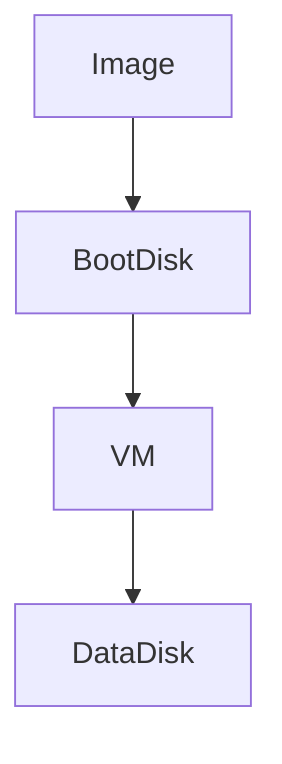
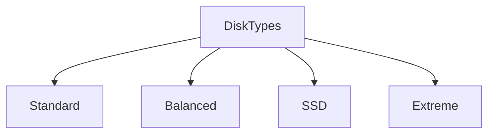
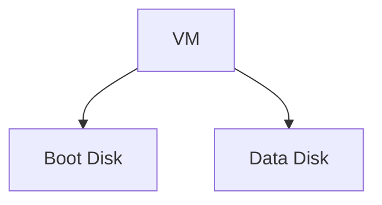
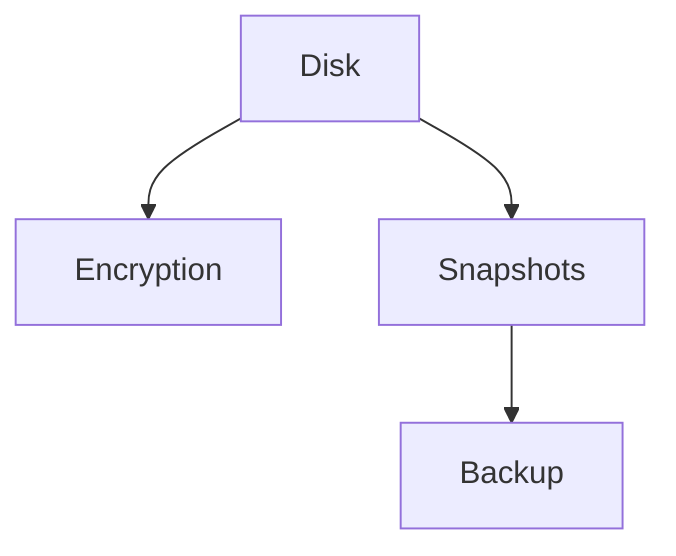
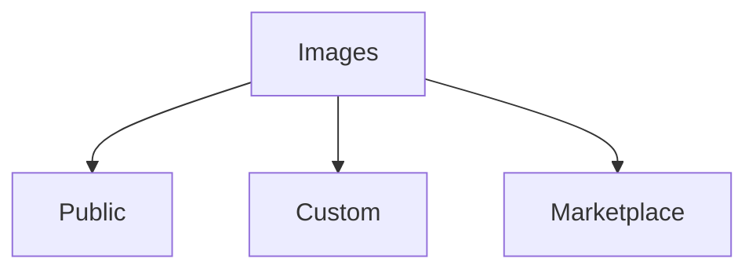
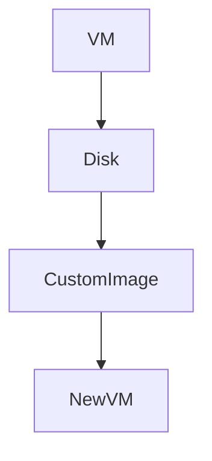
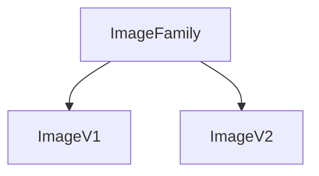
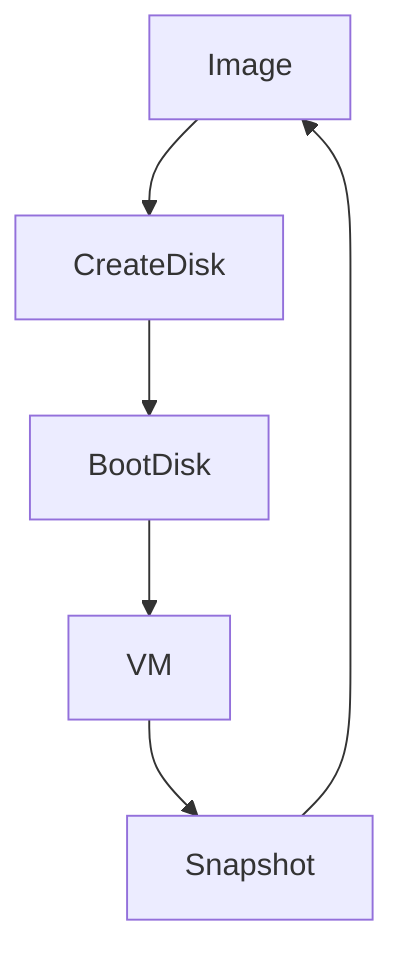

# Disk Options and Image Options in Google Compute Engine

This document explains **storage (disks)** and **OS images** used by Virtual Machines (VMs) in **Google Cloud Platform**.

Understanding these two topics is critical because:

- **Disks decide performance and cost**
- **Images decide OS, security, and maintainability**

---

## 1. Big Picture: Disk vs Image

Many beginners confuse these two. Let’s separate them clearly.

| Concept | What it is | Purpose              |
| ------- | ---------- | -------------------- |
| Image   | Template   | Used to create disks |
| Disk    | Storage    | Stores OS and data   |
| VM      | Compute    | Uses disks to run    |

---

## 2. Disk Options in GCP (Compute Engine)

A **disk** is persistent block storage attached to a VM.

Disks are **independent resources**:

- They exist even if VM stops
- They can be detached and reattached

---

## 3. Types of Disks

GCP provides **four primary disk types**.

---

## 4. Standard Persistent Disk (pd-standard)

### What it is

- HDD-backed disk
- Lowest cost
- Lowest performance

### Characteristics

- High latency
- Good for sequential reads
- Not suitable for high IOPS workloads

### Typical Use Cases

- Backups
- Cold data
- Low-traffic apps
- Dev/test environments

### Beginner rule

> Use only when performance does not matter.

### Pricing Hint

- Cheapest disk type
- Pay per GB per month

---

## 5. Balanced Persistent Disk (pd-balanced)

### What it is

- SSD-backed
- Balanced performance and cost

### Characteristics

- Good IOPS
- Moderate latency
- Default choice for most workloads

### Typical Use Cases

- Web servers
- Application servers
- General workloads

### Beginner rule

> **Best default disk** for most VMs.

### Pricing Hint

- More expensive than standard
- Cheaper than SSD

---

## 6. SSD Persistent Disk (pd-ssd)

### What it is

- High-performance SSD storage

### Characteristics

- High IOPS
- Low latency
- Predictable performance

### Typical Use Cases

- Databases
- High-traffic apps
- Analytics workloads

### Beginner rule

> Use when latency matters.

### Pricing Hint

- Higher cost
- Charged per GB per month

---

## 7. Extreme Persistent Disk (pd-extreme)

### What it is

- Ultra-high performance SSD
- Provisioned IOPS

### Characteristics

- Lowest latency
- Very high throughput
- Requires N2 or better machine types

### Typical Use Cases

- Mission-critical databases
- Enterprise systems

### Beginner warning

> Overkill for most beginners.

### Pricing Hint

- Most expensive
- Pay for storage + provisioned IOPS

---

## 8. Boot Disk vs Data Disk

### Boot Disk

- Contains OS
- Required to start VM
- Usually smaller

### Data Disk

- Stores application or database data
- Optional
- Can be resized independently

---

## 9. Disk Configuration Options (Explained)

When creating a disk, you choose:

### 1. Disk Size

- Minimum: depends on OS
- Can be increased later
- Cannot be reduced

### 2. Disk Type

- Standard / Balanced / SSD / Extreme

### 3. Encryption

- Google-managed (default)
- Customer-managed (CMEK)
- Customer-supplied (CSEK)

### 4. Snapshot Schedule

- Automated backups
- Incremental snapshots

---

## 10. Disk Pricing Summary (Conceptual)

| Disk Type | Performance | Cost      |
| --------- | ----------- | --------- |
| Standard  | Low         | Lowest    |
| Balanced  | Medium      | Medium    |
| SSD       | High        | High      |
| Extreme   | Very High   | Very High |

---

## 11. Image Options in GCP

An **image** is a **blueprint** used to create a boot disk.

Images define:

- OS
- Preinstalled software
- Security baseline

---

## 12. Types of Images

---

## 13. Public Images (OS Images)

### What they are

Official OS images provided by Google or vendors.

### Common Options

- Ubuntu
- Debian
- CentOS
- RHEL
- Windows Server

### Characteristics

- Regular security updates
- Trusted source
- Free (OS cost included except Windows/RHEL)

### Beginner rule

> Always start with public images.

### Pricing Hint

- Linux: free
- Windows / RHEL: license cost added

---

## 14. Custom Images

### What they are

Images created from your own VM disks.

### Why use them

- Preinstalled software
- Faster VM creation
- Consistency across environments

### Typical Use Cases

- Golden images
- Enterprise standards
- Auto-scaling environments

### Pricing Hint

- Storage cost for image
- No runtime cost

---

## 15. Marketplace Images

### What they are

Preconfigured images from vendors.

Examples:

- LAMP stack
- WordPress
- Databases
- Enterprise software

### Characteristics

- Ready-to-use
- Vendor-maintained
- May include licensing cost

### Beginner caution

> Understand licensing before using.

### Pricing Hint

- OS + software license cost
- VM usage still billed separately

---

## 16. Image Families

### What they are

Logical group of images with versions.

Example:

- `ubuntu-2004-lts`
- `debian-12`

### Why important

- Always get latest secure image
- No manual version updates

---

## 17. Disk + Image Lifecycle Together

This loop enables:

- Backup
- Recovery
- Scaling
- Replication

## 18. Beginner Mental Model Summary

- Image = template
- Disk = storage
- VM = compute
- Disk type affects **performance and cost**
- Image choice affects **security and maintenance**

---

Below is the **exact addition** you should include in `disk_options_&_images.md`.
You can place this under the **“Public Images (OS Images)”** section or as a small dedicated subsection.

---

## 📌 Official List of Supported OS Images (Reference)

Google maintains an **authoritative and up-to-date list** of all operating system images supported by Compute Engine, including:

- Linux distributions (Ubuntu, Debian, CentOS, Rocky, Alma, etc.)
- Windows Server versions
- Container-optimized OS
- Specialized Google-managed images
- Image families and versioning details

👉 **Official documentation:**
[https://docs.cloud.google.com/compute/docs/images/os-details](https://docs.cloud.google.com/compute/docs/images/os-details)

### Beginner guidance

> Always cross-check your OS choice against this page to avoid using deprecated or unsupported images.

---
