# Operating System (OS) Images in GCP

This document provides a full explanation of OS images used by Virtual Machines (VMs) in **Google Cloud Platform**.

OS images are a **foundational concept** in Compute Engine. Every VM starts from an image, and poor image choices lead to:

- Security risks
- Operational debt
- Patch failures
- Unsupported production systems

---

## 1. What Is an OS Image?

An **OS image** is a **bootable template** that contains:

- An operating system
- Kernel and bootloader
- Base filesystem
- Default system configuration
- (Optionally) preinstalled software

When you create a VM, GCP performs this flow:

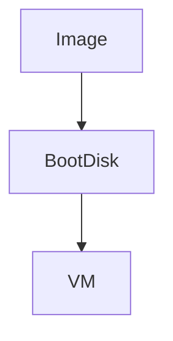

**Key idea:**
An image is **never attached directly to a VM**.
It is first used to create a **boot disk**.

---

## 2. Image vs Disk vs Snapshot (Beginner Clarification)

This confusion causes many early mistakes.

| Component | What it is  | Can it change? | Purpose          |
| --------- | ----------- | -------------- | ---------------- |
| Image     | Blueprint   | ❌ Immutable   | Create disks     |
| Disk      | Storage     | ✅ Mutable     | Store OS + data  |
| Snapshot  | Disk backup | ❌ Immutable   | Backup / restore |
| VM        | Compute     | N/A            | Runs workloads   |

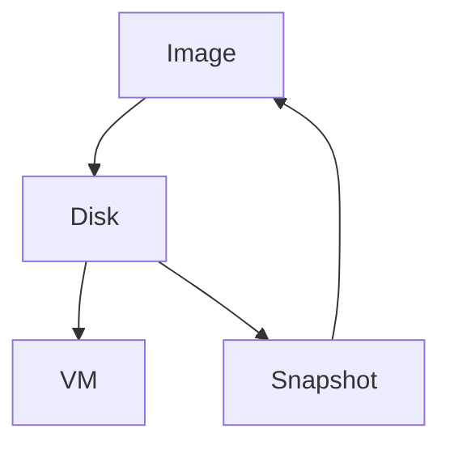

---

## 3. Categories of OS Images in GCP

GCP provides OS images in **three major categories**.

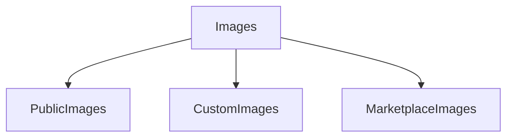

---

## 4. Public OS Images (Most Common)

### What They Are

Public images are **officially provided and maintained** by:

- Google
- OS vendors (Canonical, Red Hat, Microsoft)

They are:

- Secure
- Regularly patched
- Supported by image families

---

### 4.1 Linux Public Images

Common Linux options:

| Distribution                 | Maintainer     | Typical Use       |
| ---------------------------- | -------------- | ----------------- |
| Ubuntu LTS                   | Canonical      | General purpose   |
| Debian                       | Debian Project | Stability-focused |
| Rocky Linux                  | Community      | RHEL compatible   |
| AlmaLinux                    | Community      | RHEL compatible   |
| CentOS Stream                | Red Hat        | Rolling updates   |
| Container-Optimized OS (COS) | Google         | Containers only   |

**Beginner recommendation:**

> Use **Ubuntu LTS** or **Debian** unless you have a strong reason otherwise.

---

### 4.2 Windows Public Images

Windows images include:

- Windows Server 2019
- Windows Server 2022

Characteristics:

- Pre-licensed
- RDP enabled
- Higher cost due to licensing

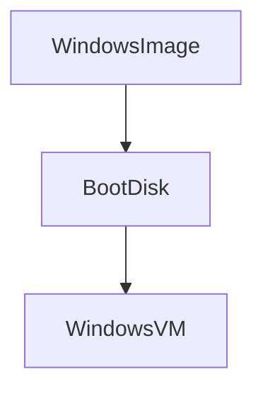

---

### 4.3 Container-Optimized OS (COS)

COS is a **minimal, hardened OS** built by Google.

Characteristics:

- Read-only root filesystem
- Auto-updates
- Optimized for Docker / Kubernetes

Use cases:

- GKE node pools
- Container-only workloads

**Beginner warning:**

> COS is **not** for traditional VM usage.

---

## 5. Official OS Image Reference (Authoritative Source)

Google maintains an **up-to-date, authoritative list** of all supported OS images, including:

- Active images
- Deprecated images
- Image families
- End-of-support timelines

👉 Official reference:
[https://docs.cloud.google.com/compute/docs/images/os-details](https://docs.cloud.google.com/compute/docs/images/os-details)

**Best practice:**

> Always verify image availability and lifecycle here before production use.

---

## 6. Image Families (Critical Concept)

### What Is an Image Family?

An **image family** is a logical alias that always points to the **latest supported image**.

Examples:

- `ubuntu-2004-lts`
- `ubuntu-2204-lts`
- `debian-12`

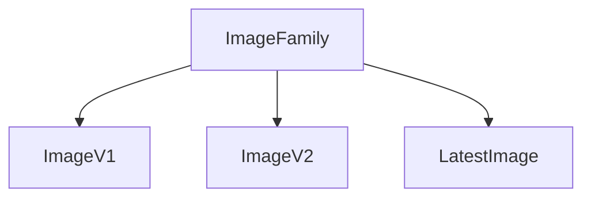

### Why Image Families Matter

- Automatically track security updates
- Prevent usage of deprecated images
- Essential for automation and scaling

**Beginner rule:**

> Always select **image families**, not fixed image versions.

---

## 7. Custom Images

### What They Are

Custom images are images **you create yourself**, typically from:

- A VM boot disk
- A snapshot

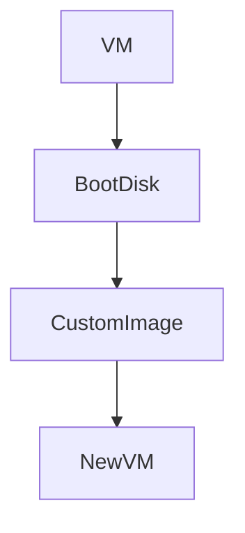

### Why They Exist

- Faster VM provisioning
- Standardized environments
- Golden image strategy
- Required for autoscaling consistency

### Typical Use Cases

- Preinstalled software stacks
- Enterprise hardening
- Managed Instance Groups

---

## 8. Marketplace Images

### What They Are

Images published by third-party vendors with preconfigured software.

Examples:

- LAMP stack
- WordPress
- Enterprise databases
- Security appliances

Characteristics:

- Ready to deploy
- Vendor maintained
- May include license costs

**Beginner caution:**

> Marketplace images can increase cost unexpectedly if licensing is misunderstood.

---

## 9. OS Image Lifecycle (Very Important)

OS images **age over time**. GCP manages them through a **defined lifecycle**.

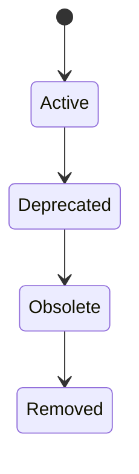

---

### 9.1 Active

**Meaning:**

- Fully supported
- Receives security updates
- Recommended for new VMs
- Part of image families

Examples:

- Ubuntu 22.04 LTS
- Debian 12

---

### 9.2 Deprecated

**Meaning:**

- Still usable
- Not recommended for new workloads
- Replacement image available

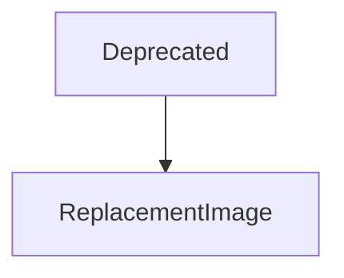

**Important:**
Existing VMs continue running, but security risk increases.

---

### 9.3 Obsolete

**Meaning:**

- No longer supported
- No security patches
- Strongly discouraged

This state is a **security liability**.

---

### 9.4 Removed

**Meaning:**

- Image no longer exists in GCP
- Cannot create new VMs from it
- Existing VMs are **not deleted**

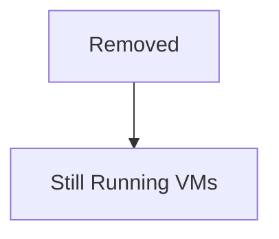

---

## 10. Image Lifecycle vs VM Lifecycle

These lifecycles are **independent**.

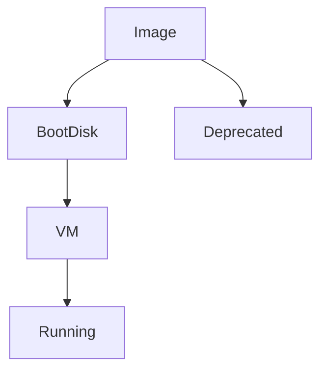

Key insight:

- Image lifecycle affects **future VMs**
- VM lifecycle affects **runtime behavior**

---

## 11. OS Images and Security

Security begins with image choice.

### Secure Image Practices

- Use supported images only
- Prefer LTS versions
- Use image families
- Avoid deprecated images
- Rotate images periodically

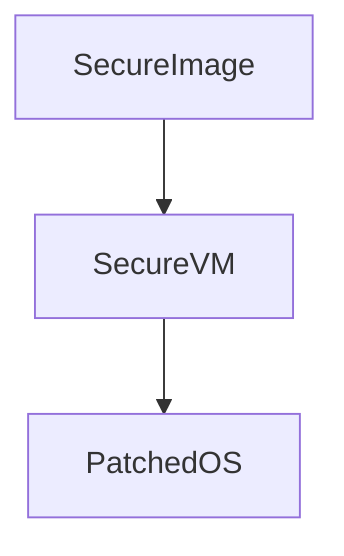

---

## 12. OS Images and Patching

### How Patching Works

- Image defines **initial state**
- After boot, OS updates are your responsibility
- Options:

  - Manual patching
  - OS Patch Management
  - Rebuild VMs from new images

**Enterprise pattern:**

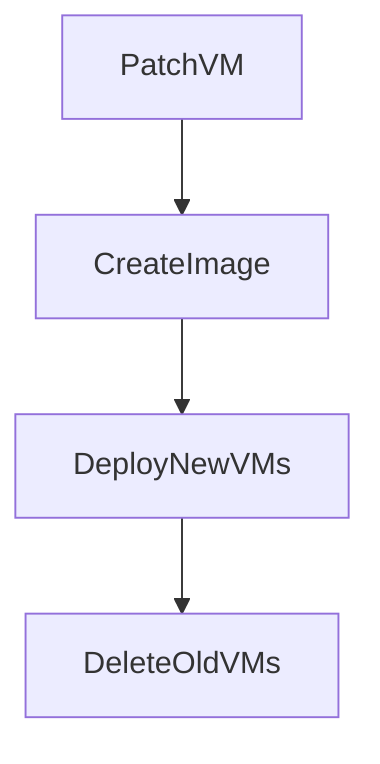

---

## 13. Pricing Impact of OS Images (Conceptual)

| Image Type         | Cost Impact      |
| ------------------ | ---------------- |
| Linux images       | Free             |
| Windows images     | License included |
| RHEL / SUSE        | License included |
| Marketplace images | Vendor-defined   |

Compute, disk, and network costs are **separate**.

---

## 14. Choosing the Right OS Image (Beginner Guide)

- Learning / Dev → **Ubuntu LTS**
- Stability → **Debian**
- RHEL ecosystem → **Rocky / Alma**
- Containers → **COS**
- Enterprise Windows → **Windows Server**

---

## 15. Beginner Mental Model (Remember This)

- Image = starting blueprint
- Image family = safe default
- Disk = runtime storage
- VM = execution
- Image lifecycle = security window
- Deprecated ≠ broken (but risky)

---

## 16. Final Takeaway

> **VMs do not automatically become secure over time — OS image lifecycle and patching strategy decide long-term safety.**

---
