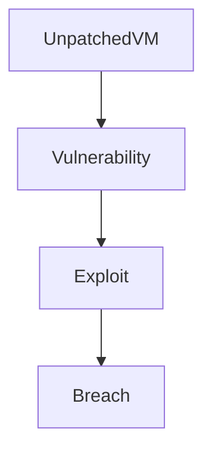
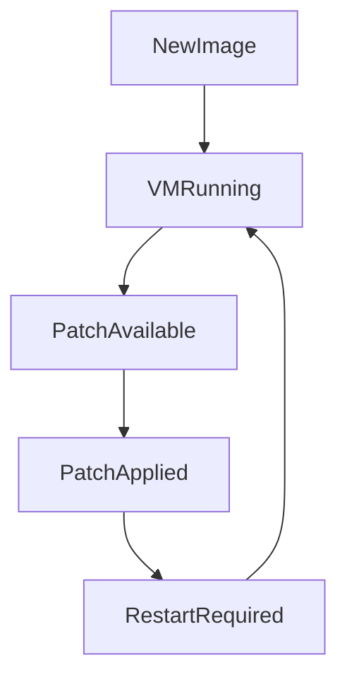
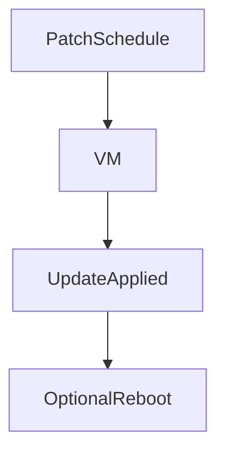
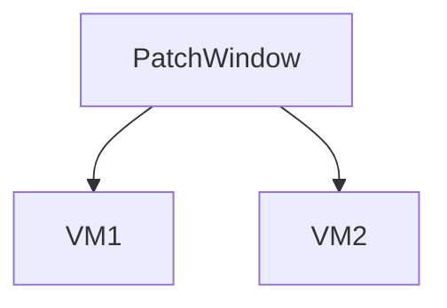
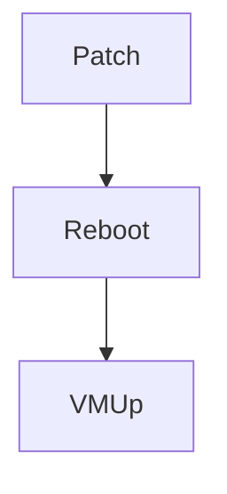
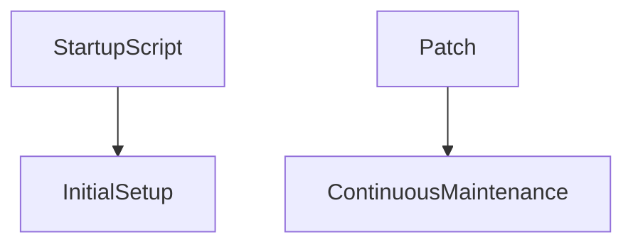
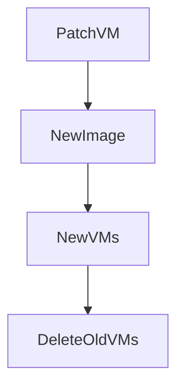
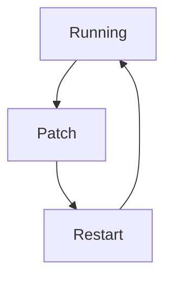

# OS Patching and Maintenance in Google Compute Engine

This document explains **operating system (OS) patching and maintenance** for Virtual Machines (VMs) running on **Google Cloud Platform**.

OS patching is one of the **most critical responsibilities** when using Compute Engine because:

- Google manages the infrastructure
- **You manage the OS**
- Unpatched systems are the #1 cause of cloud security incidents

---

## 1. What Is OS Patching?

**OS patching** means:

- Updating the operating system
- Fixing security vulnerabilities
- Applying bug fixes
- Updating system libraries and kernels

In simple terms:

> Patching keeps your VM **secure, stable, and supported**.

---

## 2. Who Is Responsible for Patching?

This depends on the compute model.

| Compute Service | Who patches the OS? |
| --------------- | ------------------- |
| Compute Engine  | **You**             |
| GKE nodes (COS) | Google              |
| App Engine      | Google              |
| Cloud Run       | Google              |
| Cloud Functions | Google              |

👉 In **Compute Engine**, **patching is your responsibility**.

---

## 3. Why Patching Is Mandatory (Beginner View)

If you don’t patch:

- Security vulnerabilities remain open
- Attackers exploit known CVEs
- Compliance audits fail
- Systems become unstable over time

---

## 4. What Gets Patched?

Patching includes:

### 4.1 OS Packages

- Kernel updates
- System libraries
- Core utilities

### 4.2 Security Updates

- CVE fixes
- Privilege escalation fixes
- Network security patches

### 4.3 Optional Updates

- Performance improvements
- Feature updates (not always recommended)

---

## 5. OS Patching Lifecycle (Conceptual)

Key idea:

- Some patches **require a reboot**
- Some do not

---

## 6. Manual OS Patching (Beginner Method)

### What It Is

You log into the VM and apply updates manually.

Example (Linux):

- SSH into VM
- Run OS update commands
- Restart services or VM

### When to Use

- Learning environments
- Small test systems
- Non-critical workloads

### Pros / Cons

| Pros              | Cons           |
| ----------------- | -------------- |
| Simple            | Not scalable   |
| Full control      | Easy to forget |
| Good for learning | Error-prone    |

---

## 7. Automated OS Patching (Recommended)

### What It Is

Using **OS Patch Management** to automate patching.

Features:

- Schedule patch jobs
- Target specific VMs
- Apply updates consistently
- Generate reports

### Why This Matters

> Automation prevents human error and forgotten updates.

---

## 8. Patch Jobs Explained (Beginner-Friendly)

A **patch job** defines:

- Which VMs to patch
- When to patch
- What type of patches to apply

You can target VMs by:

- Instance name
- Labels
- Zones
- Projects

---

## 9. Patch Windows and Scheduling

### Patch Window

A **patch window** is the allowed time for patching.

Example:

- Sundays 2 AM – 4 AM

This ensures:

- Minimal user impact
- Predictable downtime

---

## 10. Reboots and Downtime (Very Important)

### When Reboots Happen

- Kernel updates
- Critical security patches

### Options

- Allow automatic reboot
- Defer reboot
- Use rolling restarts (for groups)

**Beginner rule:**

> Always assume patching may cause a restart.

---

## 11. Startup Scripts vs Patching (Clarification)

Startup scripts:

- Run **when VM starts**
- Used for setup, not patching

Patching:

- Happens **while VM exists**
- Updates OS over time

They solve **different problems**.

---

## 12. Image-Based Patching (Best Practice)

Instead of patching running VMs forever, modern systems use **image rotation**.

### Pattern

1. Patch VM
2. Create new custom image
3. Deploy new VMs
4. Delete old VMs

This is:

- Safer
- Repeatable
- Scalable

---

## 13. Patching and VM Lifecycle

Patching interacts with VM lifecycle states.

| VM State  | Can Patch? |
| --------- | ---------- |
| Running   | ✅ Yes     |
| Stopped   | ❌ No      |
| Suspended | ❌ No      |
| Deleted   | ❌ No      |

---

## 14. Security Compliance and Patching

Most compliance standards require:

- Regular patching
- Audit logs
- Patch reports

OS Patch Management provides:

- Patch success/failure reports
- Timestamped logs
- Compliance visibility

---

## 15. Final Takeaway

> **An unpatched VM is not “working fine” — it is silently insecure.**

OS patching is not optional. It is a **core operational responsibility** when using Compute Engine.

---
