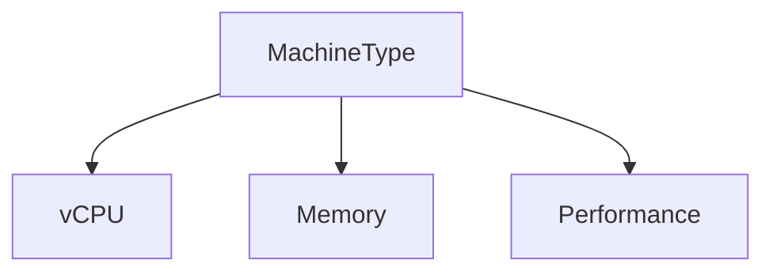
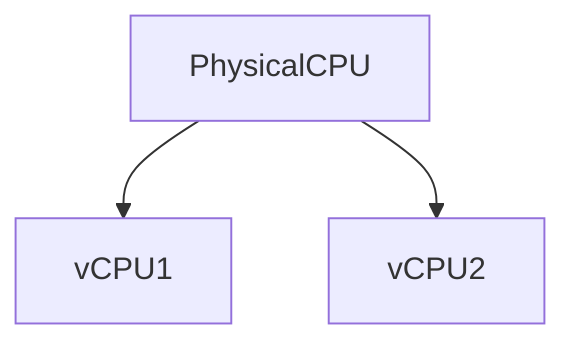
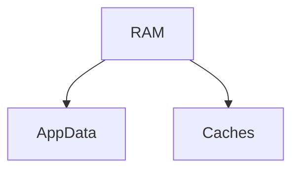
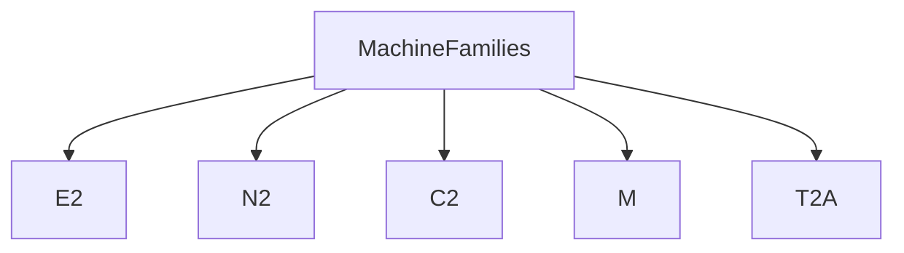
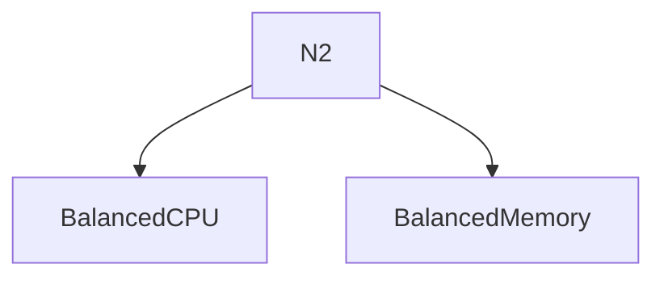
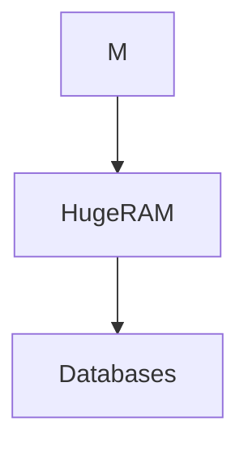
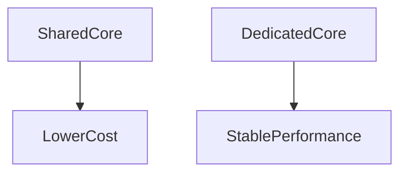
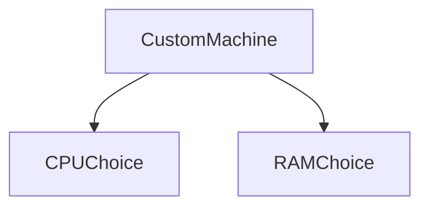
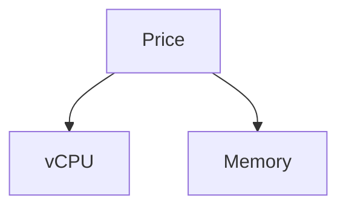
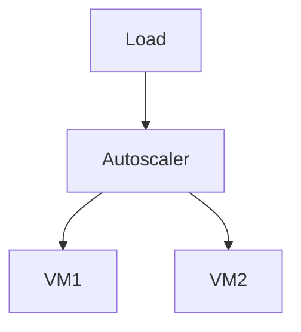

# Compute Machine Types in GCP

This document explains **machine types** in **Google Cloud Platform** Compute Engine.

Machine types define **how powerful your VM is** and directly impact:

- Performance
- Cost
- Scalability
- Reliability
- Architecture decisions

If disks define _storage_ and images define _OS_,
👉 **machine types define compute power**.

---

## 1. What Is a Machine Type?

A **machine type** specifies:

- Number of **vCPUs**
- Amount of **memory (RAM)**
- CPU performance class

In simple terms:

> A machine type is the **hardware configuration** of your virtual computer.

---

## 2. Why Machine Types Matter

Choosing the wrong machine type can cause:

- Slow applications
- High cloud bills
- Poor autoscaling
- Unstable systems

---

## 3. vCPU Explained

### What Is a vCPU?

A **vCPU** is a **virtual CPU core** allocated to your VM.

- Backed by physical CPU cores
- Shared or dedicated depending on machine type
- Determines how much computation your app can do

### Beginner intuition

- More vCPUs = more parallel work
- Does NOT always mean faster single-thread performance

---

## 4. Memory (RAM) Explained

Memory determines:

- How much data your app can hold in memory
- How many processes can run
- Whether apps crash due to OOM (out-of-memory)

---

## 5. Machine Families (Core Concept)

GCP groups machine types into **families**, each optimized for different workloads.

---

## 6. E2 Machine Family (Cost-Optimized)

### What It Is

E2 = **Efficient Second Generation**

Designed for:

- Low cost
- General workloads
- Beginners

### Characteristics

- Lower price
- Predictable performance
- No CPU credit system (unlike AWS t2/t3)

### Common Types

- `e2-micro`
- `e2-small`
- `e2-medium`

### Use Cases

- Learning GCP
- Dev/Test
- Small web apps
- Internal tools

**Beginner rule:**

> Start with **E2** unless you have a reason not to.

---

## 7. N2 Machine Family (Balanced Production)

### What It Is

N2 = **Balanced general-purpose machines**

### Characteristics

- Better performance than E2
- Dedicated cores
- Suitable for production

### Use Cases

- APIs
- Backend services
- Medium to large applications
- Databases (non-critical)

---

## 8. C2 Machine Family (Compute-Optimized)

### What It Is

C2 = **High-performance compute machines**

### Characteristics

- High clock speed
- Low latency
- Compute-heavy focus

### Use Cases

- High-throughput APIs
- Gaming servers
- Scientific computing
- Media processing

**Beginner warning:**

> Do NOT use C2 unless CPU is your bottleneck.

---

## 9. M Machine Family (Memory-Optimized)

### What It Is

M = **Memory-optimized machines**

### Characteristics

- Very high RAM
- RAM-heavy workloads
- Expensive

### Use Cases

- In-memory databases
- SAP workloads
- Large caches

---

## 10. T2A Machine Family (ARM-Based)

### What It Is

T2A = ARM-based (Ampere CPUs)

### Characteristics

- Lower cost
- Energy efficient
- ARM architecture

### Use Cases

- Cloud-native apps
- Containers
- ARM-compatible workloads

**Beginner caution:**

> Ensure your software supports ARM.

---

## 11. Shared-Core vs Dedicated-Core (Important)

### Shared-Core Machines

Examples:

- `e2-micro`
- `e2-small`

Characteristics:

- CPU shared with other VMs
- Lower cost
- Suitable for light workloads

### Dedicated-Core Machines

Examples:

- N2, C2, M families

Characteristics:

- Guaranteed CPU
- Higher cost
- Stable performance

---

## 12. Predefined vs Custom Machine Types

### Predefined

- Fixed CPU + RAM
- Easy to choose
- Common sizes

### Custom Machine Types

- Choose exact vCPU and RAM
- Reduce waste
- Better cost efficiency

**Example:**

- App needs 3 vCPU + 10 GB RAM
  → Custom machine saves money vs predefined.

---

## 13. Machine Types and Pricing (Conceptual)

Pricing depends on:

- vCPU count
- Memory size
- Machine family

Key intuition:

- Bigger machine ≠ better scaling
- Many small machines often outperform one large VM

---

## 14. Machine Types and Autoscaling

Autoscaling works better when:

- Machines are smaller
- Scale-out instead of scale-up

**Beginner rule:**

> Prefer **scaling horizontally** with moderate machine types.

---

## 15. Example Scenarios

### Example 1: Learning GCP

- `e2-micro`

### Example 2: Web Application

- `e2-medium` or `n2-standard-2`

### Example 3: Backend API

- `n2-standard-4`

### Example 4: Database

- `n2-highmem`

### Example 5: Batch Processing

- Spot `n2` machines

---

## 16. Decision Guide (Cheat Sheet)

| Use Case                    | Recommended |
| --------------------------- | ----------- |
| Learning                    | E2          |
| Dev/Test                    | E2          |
| Production API              | N2          |
| CPU-heavy                   | C2          |
| Memory-heavy                | M           |
| Cost-optimized cloud-native | T2A         |

---

## 17. Beginner Mental Model

- Machine type = VM power
- vCPU = compute
- RAM = capacity
- E2 = cheapest & safe
- N2 = production default
- Bigger is not always better

---

## 18. Final Takeaway

> **Machine types are not just sizes — they are architectural decisions that affect cost, performance, and scalability.**

Choose them deliberately.

---
