# Instance Templates in GCP

This document explains **instance templates** in **Google Cloud Platform** Compute Engine.

Instance templates are one of the **most important concepts** in Compute Engine because:

- They enable **scaling**
- They enable **high availability**
- They enable **immutable infrastructure**
- They are required for **Managed Instance Groups (MIGs)**

If machine types define _power_,
👉 **instance templates define how VMs are created consistently**.

---

## 1. What Is an Instance Template?

An **instance template** is a **blueprint** that defines how a VM should be created.

It includes:

- Machine type
- Boot disk and image
- Disks
- Network settings
- Service account
- Metadata and startup scripts
- Security settings

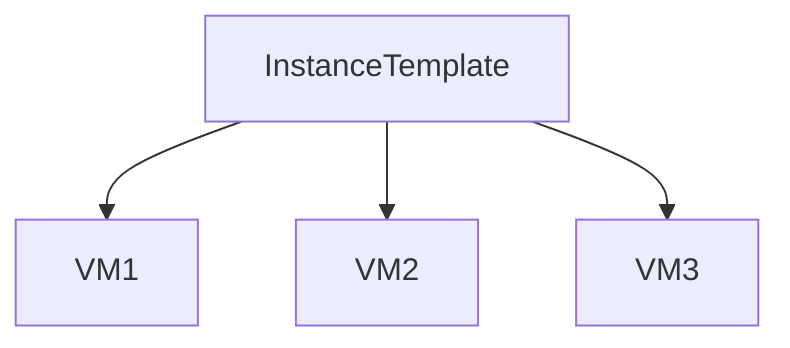

**Key idea:**

> Templates create VMs — they are not VMs themselves.

---

## 2. Why Instance Templates Exist

Without templates:

- Every VM is configured manually
- Inconsistencies creep in
- Scaling becomes impossible
- Recovery is slow and error-prone

With templates:

- Every VM is identical
- Scaling is automatic
- Failures are self-healed

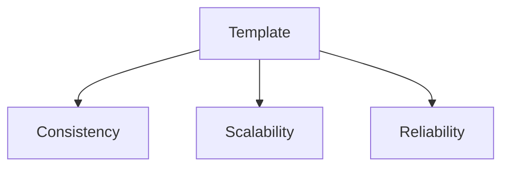

---

## 3. Instance Templates vs VMs (Beginner Clarification)

| Aspect      | VM                | Instance Template           |
| ----------- | ----------------- | --------------------------- |
| Purpose     | Runs workloads    | Defines how VMs are created |
| Mutable     | Yes               | ❌ No (immutable)           |
| Lifecycle   | Start/stop/delete | Create → use → replace      |
| Used by MIG | No                | ✅ Yes                      |

---

## 4. Immutability (Core Concept)

Instance templates are **immutable**.

- You **cannot edit** a template
- Any change requires a **new template**

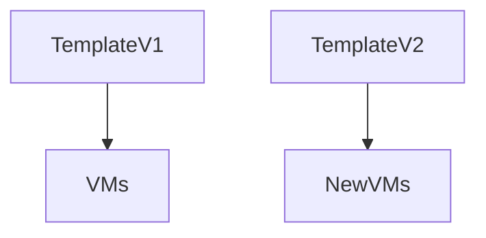

**Beginner takeaway:**

> Templates are versioned by **replacement**, not modification.

---

## 5. What Does an Instance Template Contain?

An instance template captures **almost every VM creation option**.

---

### 5.1 Machine Configuration

Includes:

- Machine family (E2, N2, etc.)
- vCPU and RAM
- Shared or dedicated core

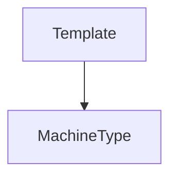

---

### 5.2 Boot Disk and OS Image

Defines:

- OS image or image family
- Disk type (Balanced SSD, SSD, etc.)
- Disk size
- Auto-delete behavior

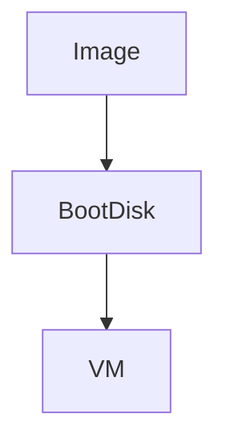

---

### 5.3 Additional Disks (Optional)

Templates can define:

- Data disks
- Disk size and type
- Read/write mode

Used for:

- Stateful apps
- Databases (with caution)

---

### 5.4 Networking Configuration

Includes:

- VPC network
- Subnet
- Internal IP
- External IP (optional)

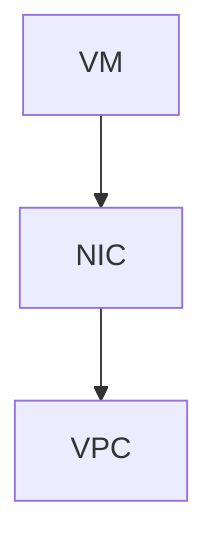

---

### 5.5 Firewall and Tags

Templates define:

- Network tags
- Used by firewall rules

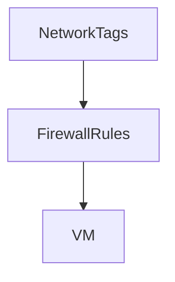

---

### 5.6 Service Account and IAM

Defines:

- Which service account the VM uses
- What APIs it can access

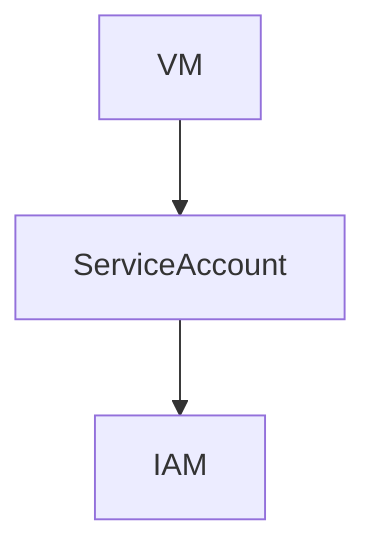

**Best practice:**

> Least privilege always.

---

### 5.7 Metadata and Startup Scripts

Templates can embed:

- Metadata key-values
- Startup scripts
- Configuration flags

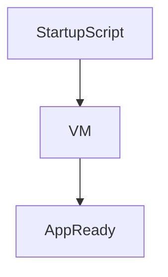

This is **how automation happens**.

---

### 5.8 Security Settings

Includes:

- Shielded VM options
- Secure boot
- vTPM
- Integrity monitoring

Used for:

- Compliance
- Hardening

---

## 6. What Instance Templates Do NOT Include

Templates do **not** include:

- Instance name
- Zone
- Internal IP (static)
- Runtime state
- Data written after boot

These are determined **at VM creation time**.

---

## 7. How Instance Templates Are Used

Templates are usually used in **two ways**.

---

### 7.1 Creating Individual VMs

You _can_ create a single VM from a template.

Use cases:

- Consistency
- Manual testing
- Golden VM pattern

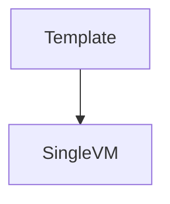

---

### 7.2 Managed Instance Groups (Most Important)

Templates are the **foundation of MIGs**.

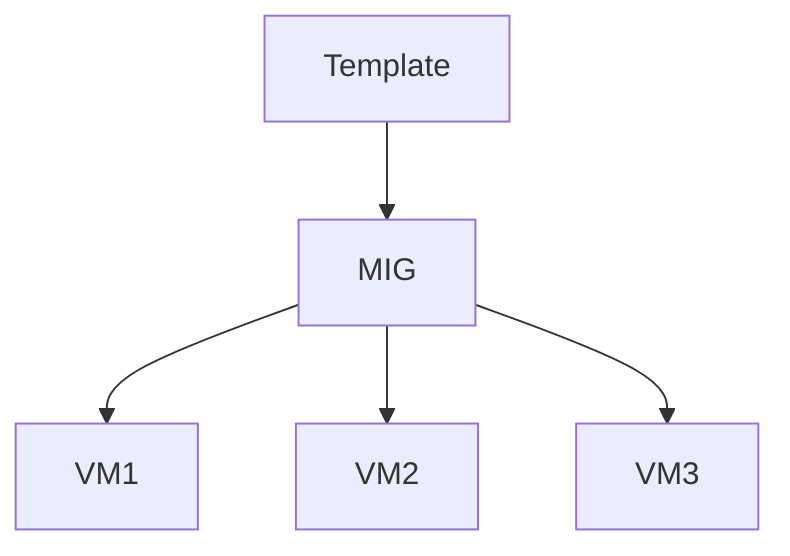

Without templates:

- No autoscaling
- No autohealing
- No rolling updates

---

## 8. Template Lifecycle

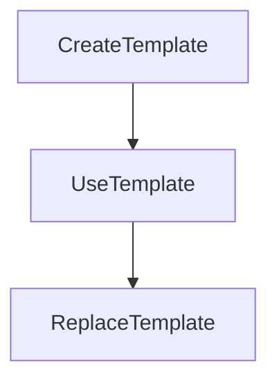

Key points:

- Templates live forever unless deleted
- Old templates remain usable
- Versioning is manual (name-based)

---

## 9. Updating VMs Using Templates

You **never update a template**.

Instead:

1. Create new template (v2)
2. Update MIG to use new template
3. Roll out new VMs
4. Delete old VMs

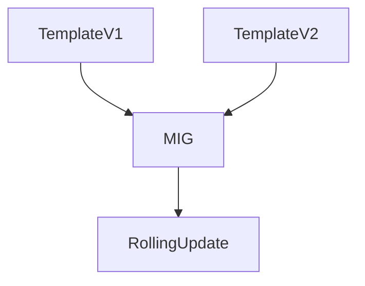

---

## 10. Templates vs Custom Images

| Aspect        | Template         | Custom Image  |
| ------------- | ---------------- | ------------- |
| Purpose       | VM definition    | OS + software |
| Mutable       | No               | No            |
| Contains OS   | References image | Contains OS   |
| Used together | ✅ Yes           | ✅ Yes        |

Best practice:

> **Custom Image + Instance Template = Production standard**

---

## 11. Beginner Example (End-to-End)

### Scenario: Web App Template

Template includes:

- `n2-standard-2`
- Ubuntu LTS image family
- Startup script installs Nginx
- Network tag `web-server`
- Service account with storage read access

Result:

- Every VM starts identically
- Ready to serve traffic in seconds

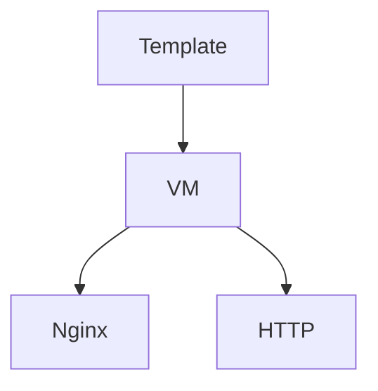

---

## 12. Beginner Mental Model

- Template = blueprint
- Immutable by design
- Used for scale and recovery
- Changes = new template
- MIGs depend on templates

---

## 13. When You MUST Use Instance Templates

- Autoscaling
- High availability
- Production workloads
- Blue/green deployments
- Self-healing systems

---

## 14. Final Takeaway

> **If Compute Engine is the engine, instance templates are the assembly line.**

They are **mandatory** for reliable, scalable systems.

---
