# Managed Instance Groups (MIGs) in GCP

This document explains **Managed Instance Groups (MIGs)** in **Google Cloud Platform** Compute Engine.

MIGs are one of the **most important concepts in Compute Engine** because they enable:

- High availability
- Autoscaling
- Self-healing
- Rolling updates
- Production-grade VM architectures

👉 **MIGs define how many VMs exist and how they behave over time**.

---

## 1. What Is a Managed Instance Group (MIG)?

A **Managed Instance Group** is a service that:

- Creates **multiple identical VMs**
- From **one instance template**
- And manages them **automatically**

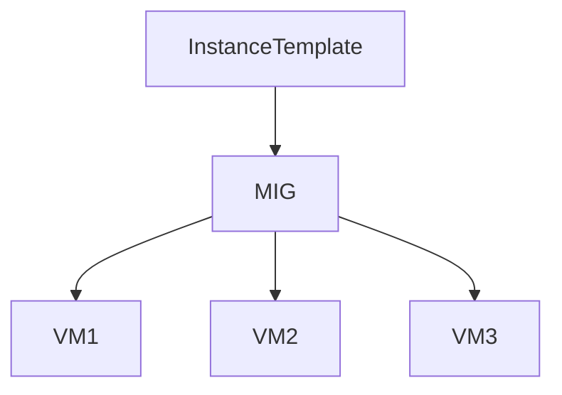

**Key idea:**

> You do not manage individual VMs — **you manage the group**.

---

## 2. Why MIGs Exist (Beginner Perspective)

Without MIGs:

- If a VM crashes → app goes down
- Scaling requires manual VM creation
- Updates cause downtime
- Inconsistencies appear

With MIGs:

- Failed VMs are recreated automatically
- Traffic is spread across VMs
- Capacity grows and shrinks automatically
- Updates happen safely

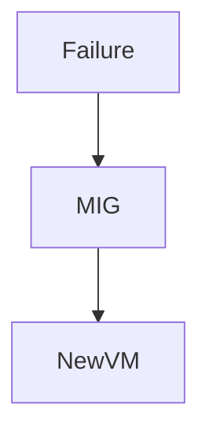

---

## 3. Core Building Blocks of a MIG

A MIG is built from **four essential components**.

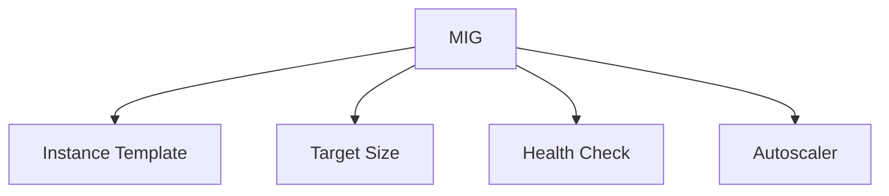

Let’s understand each.

---

## 4. Instance Template (Mandatory)

A MIG **cannot exist without an instance template**.

The template defines:

- Machine type
- OS image
- Disks
- Networking
- Startup scripts
- Security settings

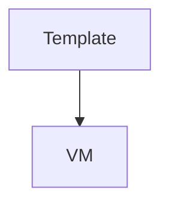

**Important rule:**

> All VMs in a MIG are **identical by design**.

---

## 5. Target Size (Desired Number of VMs)

The **target size** defines:

- How many VMs should exist **at any time**

Example:

- Target size = 3
  → MIG always tries to keep **3 healthy VMs running**

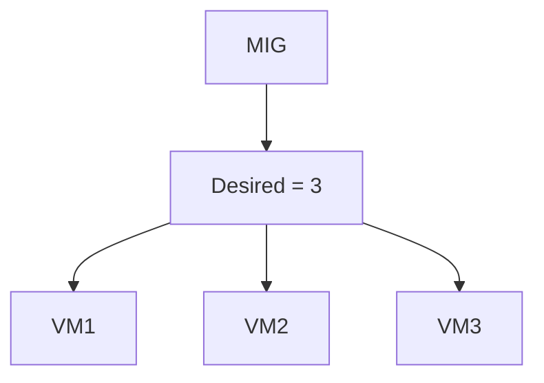

If one VM fails:

- MIG creates a replacement automatically

---

## 6. Health Checks (Self-Healing)

### What Is a Health Check?

A **health check** determines whether a VM is healthy.

It can check:

- HTTP response
- HTTPS response
- TCP connection

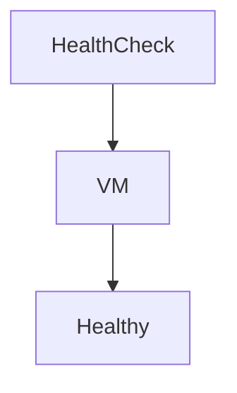

---

### Why Health Checks Matter

If a VM:

- Stops responding
- Crashes
- Fails startup

The MIG:

1. Marks it unhealthy
2. Deletes it
3. Creates a new VM

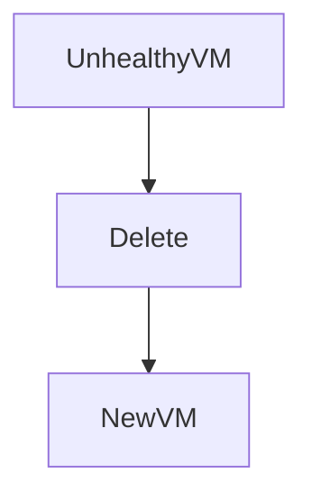

This is called **autohealing**.

---

## 7. Autoscaling (Dynamic Capacity)

Autoscaling allows a MIG to:

- Increase VMs when load increases
- Decrease VMs when load decreases

### Autoscaling Signals

MIGs can autoscale based on:

- CPU utilization
- Load balancer requests
- Custom metrics

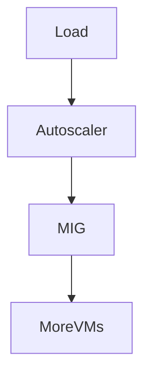

---

### Example: CPU-Based Autoscaling

Rule:

- Keep average CPU at ~60%

If CPU goes above:

- MIG adds more VMs

If CPU drops:

- MIG removes VMs

---

## 8. Zonal vs Regional MIGs (Very Important)

### 8.1 Zonal MIG

- All VMs in **one zone**
- Simpler
- Less resilient

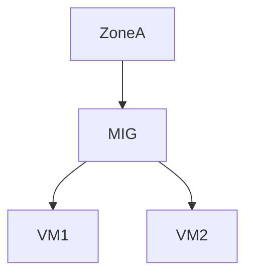

### When to use:

- Dev/Test
- Non-critical workloads

---

### 8.2 Regional MIG (Recommended for Production)

- VMs spread across **multiple zones**
- Survives zone failure
- Higher availability

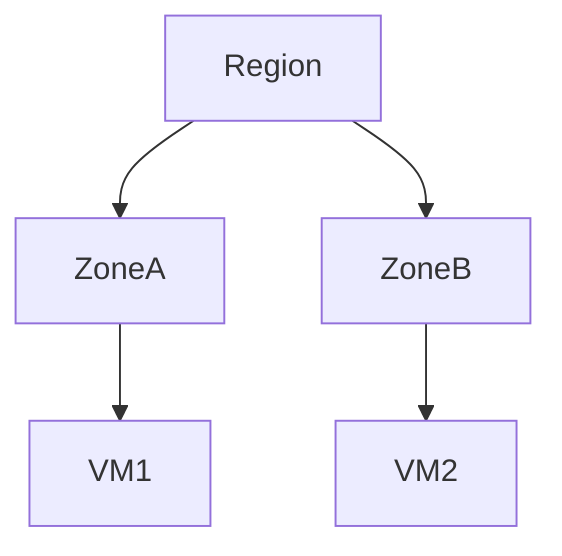

**Beginner rule:**

> Use **regional MIGs** for production.

---

## 9. Load Balancing with MIGs

MIGs are commonly used **behind load balancers**.

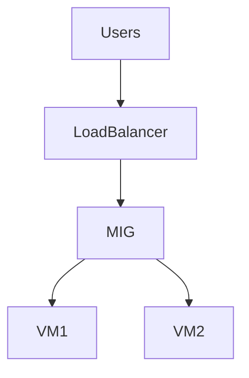

Benefits:

- Traffic distribution
- No single point of failure
- Horizontal scaling

---

## 10. Autohealing (Repairing Failed VMs)

Autohealing:

- Uses health checks
- Detects unhealthy instances
- Recreates them automatically

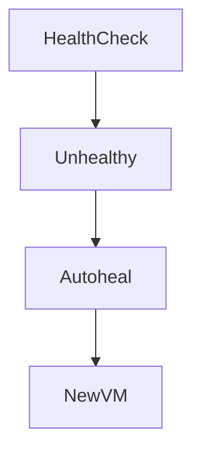

**Important:**

> Autohealing replaces the VM — it does not “fix” it.

---

## 11. Updating MIGs (Rolling Updates)

You **never update VMs directly** in a MIG.

Instead:

1. Create new instance template (v2)
2. Update MIG to use new template
3. Roll out changes gradually

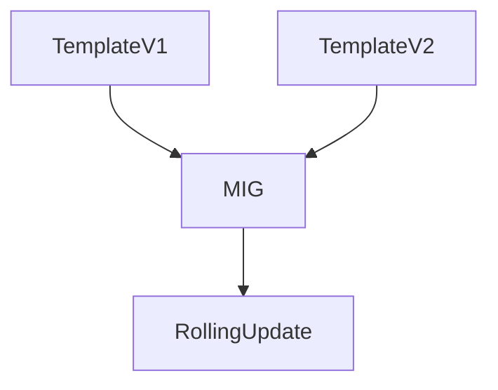

---

### Rolling Update Strategies

You can control:

- How many VMs update at once
- Whether to pause between updates
- Whether to recreate or restart VMs

This prevents downtime.

---

## 12. Stateful vs Stateless MIGs

### Stateless MIGs (Most Common)

- VMs do not store local state
- Easy to replace
- Highly scalable

**Recommended for beginners.**

---

### Stateful MIGs (Advanced)

- Preserve:
  - Disks
  - Hostnames
  - IPs

Used for:

- Stateful services
- Legacy systems

**Beginner warning:**

> Stateful MIGs are complex — avoid initially.

---

## 13. MIG Lifecycle (High Level)

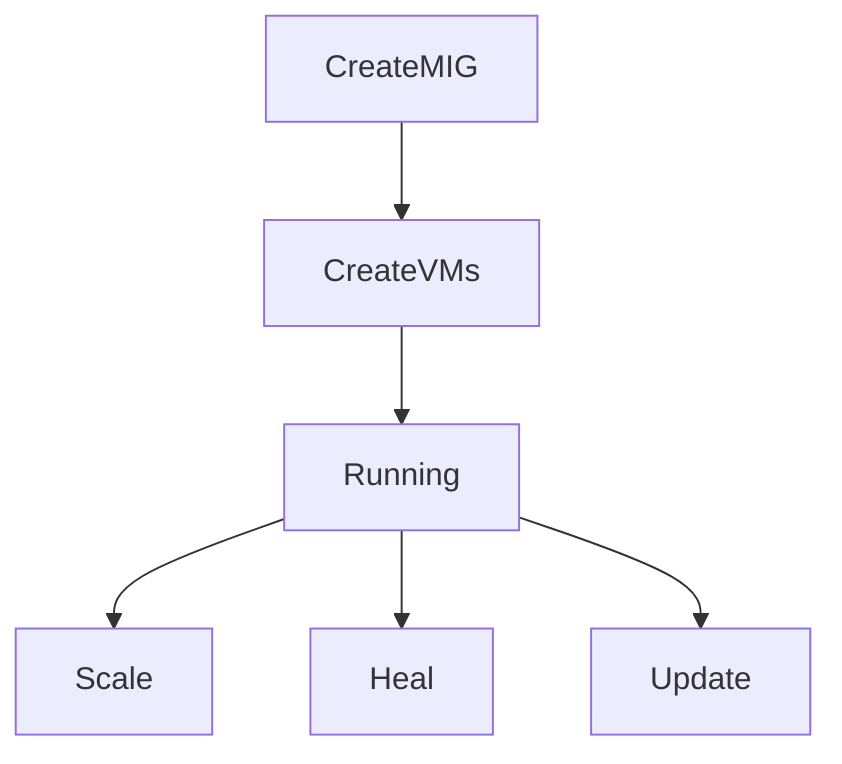

---

## 14. Example: Simple Web App MIG

### Scenario

- Web application
- Needs high availability

### Setup

- Instance template with Nginx
- Regional MIG
- Target size = 3
- HTTP health check
- Autoscaling enabled

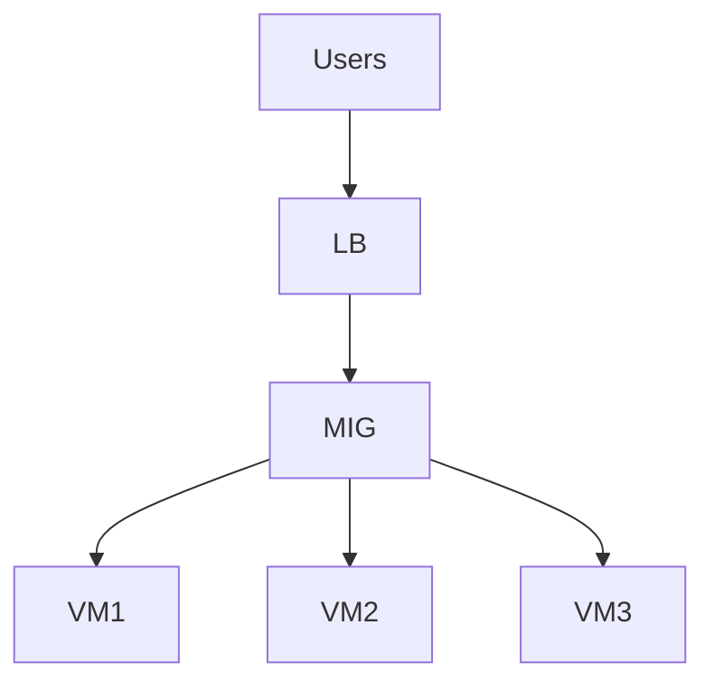

Result:

- One VM fails → auto-replaced
- Traffic spikes → auto-scaled
- No downtime

---

## 15. Final Takeaway

> **Managed Instance Groups turn fragile VMs into resilient systems.**

If you use Compute Engine in production **without MIGs**, you are accepting unnecessary risk.

---
