# Autoscaling and Autohealing in GCP

This document explains **autoscaling** and **autohealing** in **Google Cloud Platform** Compute Engine.

These two concepts are the **core reasons Managed Instance Groups (MIGs) are production-ready**.

If you remember one sentence:

> **Autoscaling handles load. Autohealing handles failure.**

---

## 1. Why Autoscaling and Autohealing Exist

### Traditional VM Problems

Without automation:

- Traffic spikes → app crashes
- Traffic drops → money wasted
- VM crashes → manual recovery
- Human intervention required

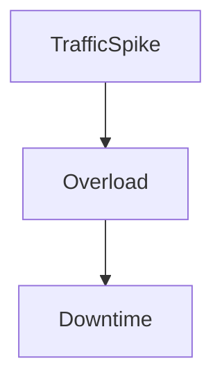

Autoscaling and autohealing **remove humans from the critical path**.

---

## 2. Autoscaling — What It Really Means

### What Is Autoscaling?

**Autoscaling** automatically:

- Adds VMs when load increases
- Removes VMs when load decreases

Autoscaling works **only with Managed Instance Groups (MIGs)**.

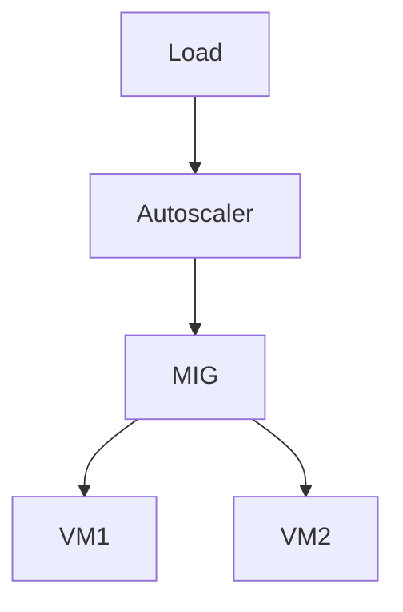

---

## 3. What Autoscaling Is NOT (Beginner Clarification)

❌ It does NOT resize a VM
❌ It does NOT upgrade machine types
❌ It does NOT scale disks

✅ It **changes the number of VMs**

---

## 4. Autoscaling Components (Mental Model)

Autoscaling has **three core pieces**:

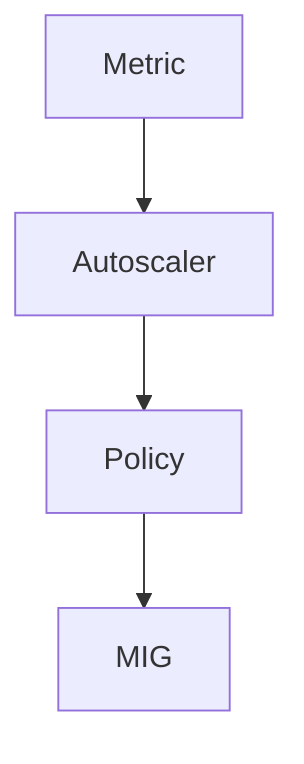

1. **Metric** – what to watch
2. **Policy** – how to react
3. **MIG** – where scaling happens

---

## 5. Autoscaling Signals (What Triggers Scaling)

### 5.1 CPU Utilization (Most Common)

- Target average CPU (e.g., 60%)
- Scale out when exceeded
- Scale in when below

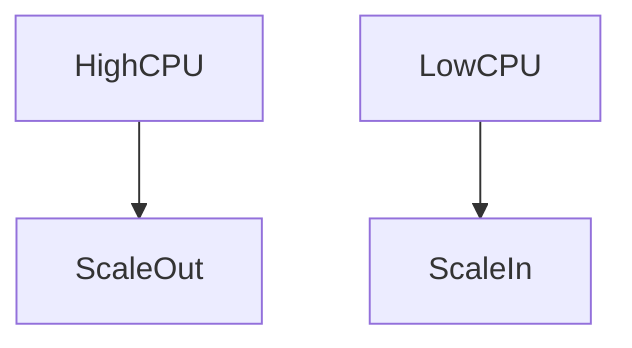

**Beginner tip:**

> CPU-based autoscaling is the easiest to start with.

---

### 5.2 Load Balancer Request Rate

Used when:

- MIG is behind a load balancer
- Traffic is request-driven

Example:

- 100 requests/sec per VM

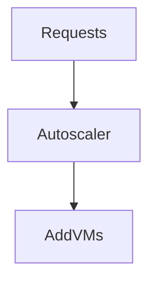

---

### 5.3 Custom Metrics (Advanced)

Examples:

- Queue length
- Jobs waiting
- Memory usage
- Application-level signals

Used in:

- Data processing
- Background workers

**Beginner note:**

> Avoid custom metrics initially.

---

## 6. Autoscaling Limits (Very Important)

Autoscaling always respects **boundaries**.

| Setting           | Meaning             |
| ----------------- | ------------------- |
| Minimum instances | Never go below this |
| Maximum instances | Never exceed this   |

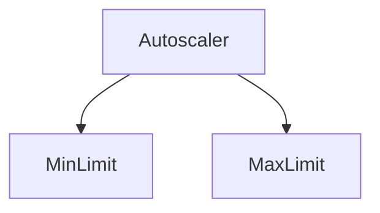

**Beginner rule:**

> Always set a **minimum > 1** for production.

---

## 7. Scale-Out vs Scale-In (Key Difference)

### Scale-Out (Add VMs)

- Triggered by high load
- Improves availability
- Costs more

### Scale-In (Remove VMs)

- Triggered by low load
- Saves money
- Must be done carefully

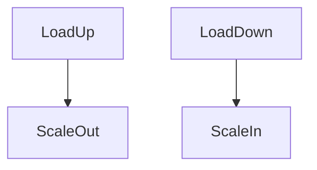

---

## 8. Cooldown Periods (Why Scaling Isn’t Instant)

Autoscaling uses **cooldown periods** to prevent flapping.

Why?

- VM startup takes time
- Metrics need time to stabilize

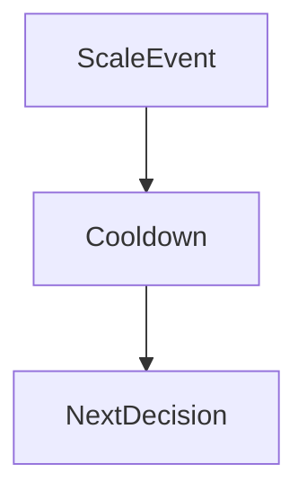

This avoids:

- Rapid scale-up/down
- Unstable systems

---

## 9. Autohealing — Handling Failures

### What Is Autohealing?

**Autohealing** automatically:

- Detects unhealthy VMs
- Deletes them
- Replaces them with new ones

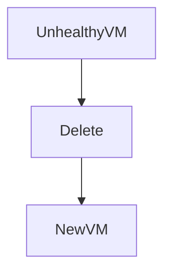

---

## 10. Autohealing vs Autoscaling (Clear Difference)

| Feature     | Autoscaling     | Autohealing    |
| ----------- | --------------- | -------------- |
| Purpose     | Handle load     | Handle failure |
| Trigger     | Metrics         | Health checks  |
| Action      | Change VM count | Replace VM     |
| Cost impact | Variable        | Neutral        |

---

## 11. Health Checks (Foundation of Autohealing)

Autohealing depends on **health checks**.

Health checks can be:

- HTTP
- HTTPS
- TCP

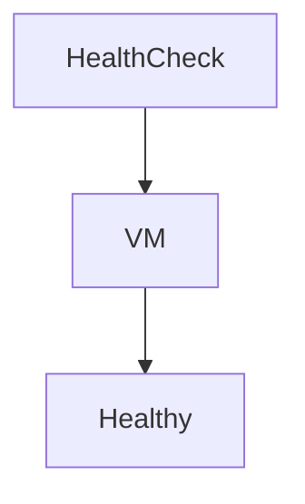

If a VM fails:

- It is **recreated**, not repaired

---

## 12. Autohealing Process (Step-by-Step)

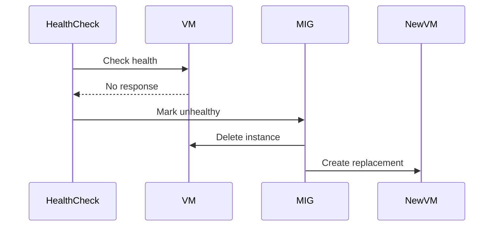

**Key idea:**

> MIGs treat VMs as **replaceable units**, not pets.

---

## 13. Autoscaling + Autohealing Together (Real World)

In production, both work **simultaneously**.

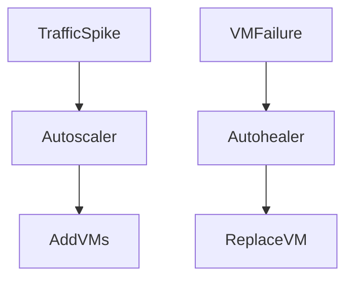

This gives:

- Elasticity
- Resilience
- Zero-touch operations

---

## 14. Zonal vs Regional Impact

### Zonal MIG

- Autohealing works within one zone
- Zone failure = outage

### Regional MIG (Recommended)

- Autohealing across zones
- Zone failure handled automatically

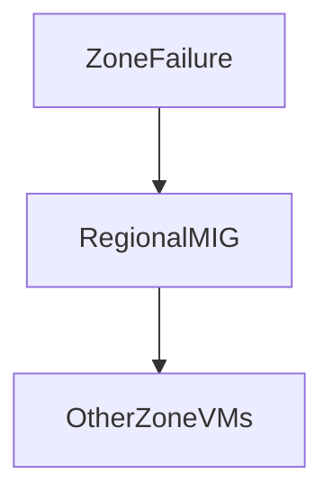

---

## 15. Example: Web Application Autoscaling

### Scenario

- Web app traffic varies daily

### Configuration

- Regional MIG
- CPU autoscaling at 60%
- Min = 2, Max = 10
- HTTP health check

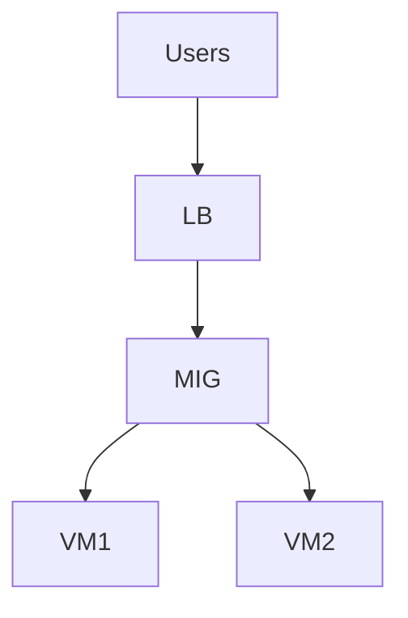

### Result

- Traffic spike → scale out
- VM crash → autohealed
- Traffic drop → scale in

---

## 16. Final Takeaway

> **Autoscaling keeps your app responsive.
> Autohealing keeps your app alive.**

Together, they transform Compute Engine from “VM hosting” into a **self-managing system**.

---
