# Load Balancing with Compute Engine

This document explains how **Load Balancing works with Compute Engine** in **Google Cloud Platform**.

If you remember one idea:

> A Load Balancer distributes traffic across multiple VMs to keep your system fast and available.

This document explains:

- What a load balancer is
- Why it is required
- How it works with Managed Instance Groups (MIGs)
- Core components
- Types of load balancers
- Health checks
- Real-world examples

---

# 1. What Is Load Balancing?

Imagine you have **one VM** serving a website.

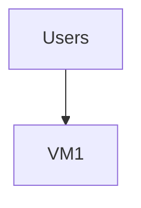

Problems:

- If VM crashes → site goes down
- If traffic increases → VM overloads
- No redundancy

Now imagine **multiple VMs**:

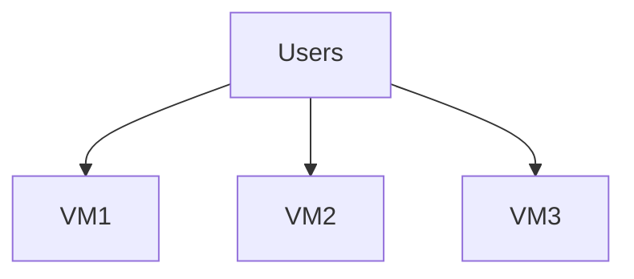

But users need **one entry point**, not three IPs.

That entry point is the **Load Balancer**.

---

# 2. What a Load Balancer Does

A load balancer:

1. Receives incoming traffic
2. Chooses a healthy backend VM
3. Forwards the request
4. Returns the response

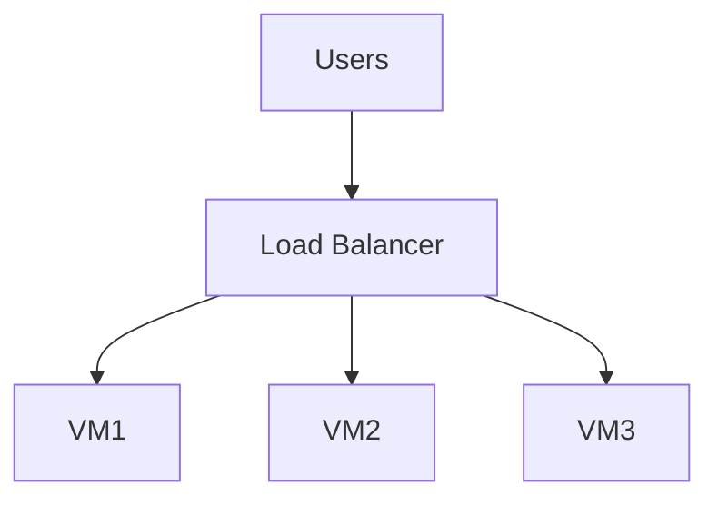

---

# 3. Why Load Balancing Is Required

Without load balancing:

| Problem           | Result         |
| ----------------- | -------------- |
| Single VM failure | Downtime       |
| Traffic spike     | Overload       |
| Manual scaling    | Slow response  |
| Uneven traffic    | Resource waste |

With load balancing:

- High availability
- Horizontal scaling
- Traffic distribution
- Health-based routing

---

# 4. Core Components of GCP Load Balancing

A load balancing setup includes:

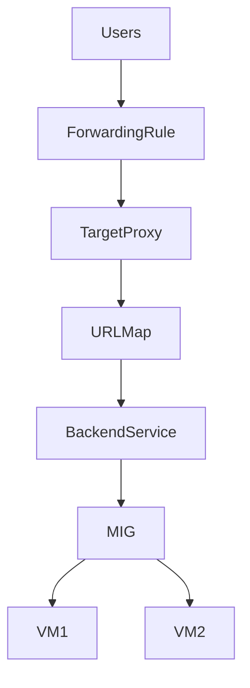

Let’s break this down simply.

---

## 4.1 Forwarding Rule

- Public IP
- Listens on a port (80, 443)
- Entry point for traffic

Think of it as:

> “The address users connect to.”

---

## 4.2 Target Proxy

Handles:

- HTTP
- HTTPS
- SSL termination

For HTTPS:

- Stores SSL certificate
- Decrypts traffic

---

## 4.3 URL Map

Used for:

- Path-based routing
- Host-based routing

Example:

- `/api` → API backend
- `/static` → static backend

---

## 4.4 Backend Service

Defines:

- Where traffic goes
- Which MIG is used
- Health check configuration

---

## 4.5 Backend (MIG)

The actual VMs serving traffic.

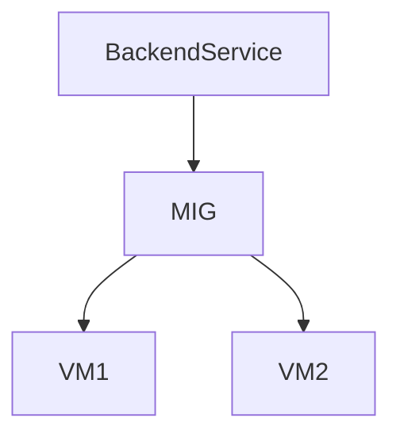

---

# 5. Load Balancer + MIG Integration

MIG and Load Balancer work together.

- Load balancer distributes traffic
- MIG ensures enough healthy VMs exist
- Autoscaler adjusts capacity

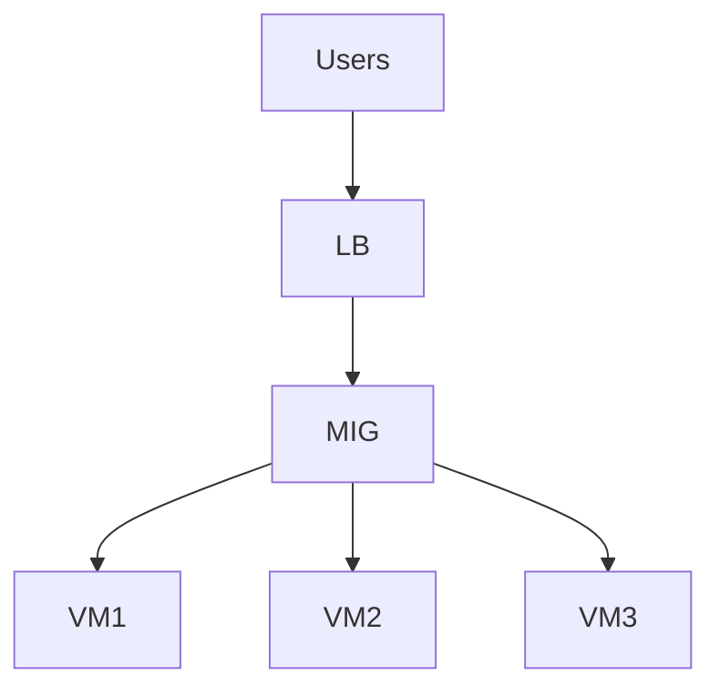

---

# 6. Health Checks (Critical Concept)

Load balancers use **health checks** to decide:

- Which VMs are healthy
- Which VMs should receive traffic

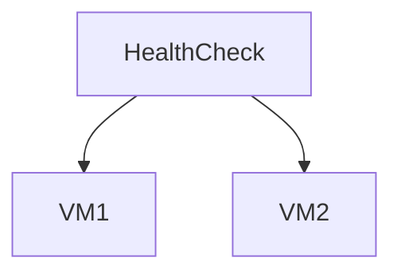

If VM2 fails:

- It stops receiving traffic
- MIG may replace it

This prevents routing to broken servers.

---

# 7. Types of Load Balancers in GCP

GCP provides multiple types. For Compute Engine beginners, focus on:

---

## 7.1 HTTP(S) Load Balancer (Most Common)

Used for:

- Websites
- APIs
- Web applications

Features:

- Global
- SSL support
- Path-based routing
- Autoscaling friendly

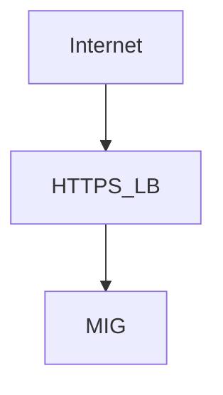

---

## 7.2 TCP/UDP Load Balancer

Used for:

- Non-HTTP traffic
- Custom protocols
- Gaming servers

Less intelligent than HTTP LB.

---

## 7.3 Internal Load Balancer

Used for:

- Internal services
- Microservices communication
- Private APIs

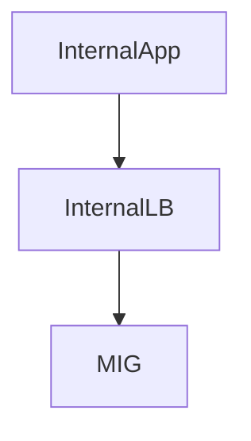

---

# 8. Traffic Flow Example (End-to-End)

Example: Web app with autoscaling.

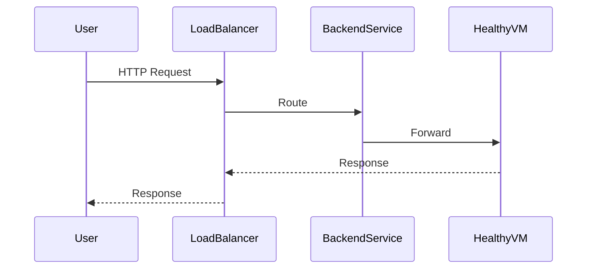

If traffic spikes:

- Autoscaler adds more VMs
- Load balancer automatically distributes traffic

---

# 9. Global vs Regional Load Balancing

### Global HTTP(S) LB

- Single global IP
- Routes to nearest healthy region

### Regional LB

- Limited to one region

Beginner rule:

> Use global HTTP(S) load balancer for public apps.

---

# 10. Common Load Balancing Algorithms

GCP handles balancing automatically, but conceptually:

- Round-robin
- Least connections
- Capacity-based

You don’t manually configure these in most cases.

---

# 11. Example: Simple Production Setup

### Goal:

Highly available web app.

### Architecture:

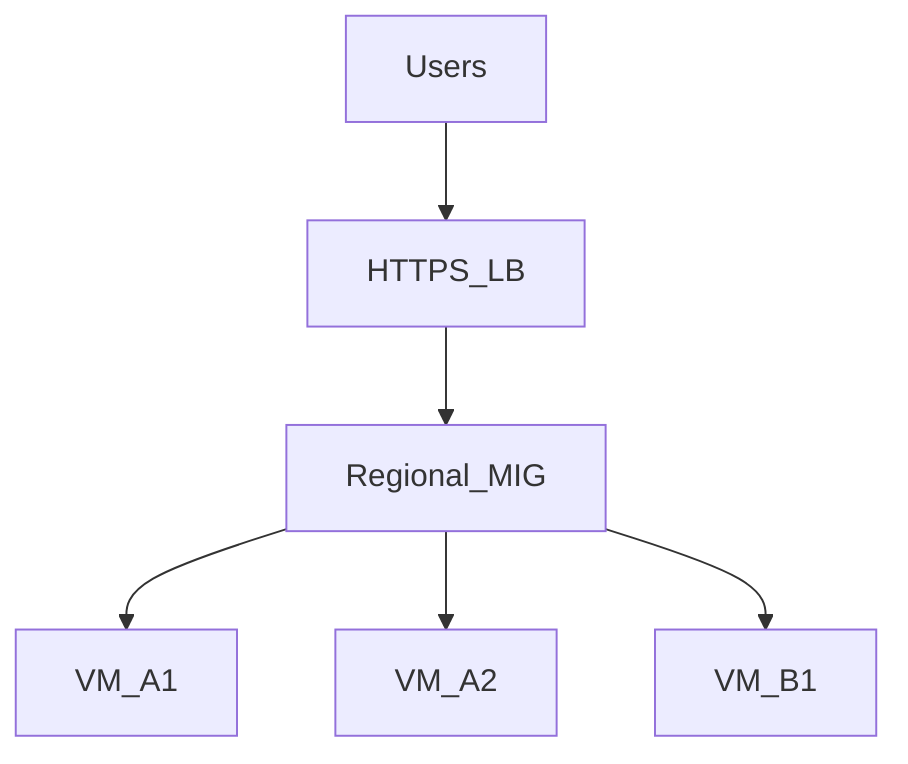

- Regional MIG across 2 zones
- Min instances = 2
- Autoscaling enabled
- HTTP health check
- SSL certificate configured

Result:

- Zone failure → traffic rerouted
- VM crash → autohealed
- Traffic spike → autoscaled

---

# 12. Final Takeaway

> **Load balancing turns multiple VMs into a single reliable service endpoint.**

Without load balancing:

- Scaling is incomplete
- High availability is fragile
- Production readiness is missing

---
