# VM Security Best Practices in Google Compute Engine

This document explains how to secure Virtual Machines (VMs) in **Google Cloud Platform** Compute Engine.

Security in Compute Engine follows a shared responsibility model:

- Google secures: hardware, data centers, hypervisor
- You secure: operating system, network exposure, IAM access, application

If you remember one sentence:

> **An unsecured VM is just a public server waiting to be attacked.**

---

# 1. Understanding the Security Layers

VM security is layered. Think of it like protection rings.

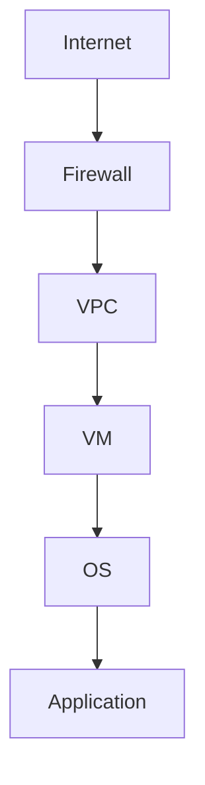

Each layer must be secured independently.

Security layers:

1. Network (firewalls, IPs)
2. Identity (IAM, service accounts)
3. OS hardening
4. Metadata protection
5. Encryption
6. Monitoring

---

# 2. Network-Level Security (First Line of Defense)

## 2.1 Firewall Rules

By default, VMs are not open to the internet — unless you allow it.

Best practices:

- Only open required ports
- Never open unnecessary ports (e.g., 0.0.0.0/0 for SSH)
- Use network tags to restrict rules

Example:

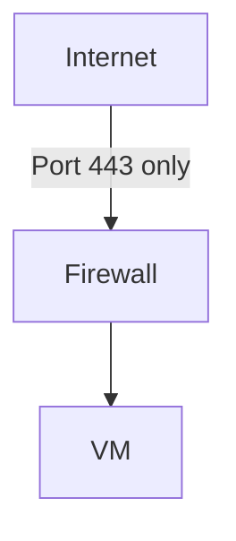

Bad practice:

- Allowing SSH (22) from 0.0.0.0/0

Better practice:

- Restrict SSH to specific IP ranges
- Or use IAP (Identity-Aware Proxy)

---

## 2.2 Avoid Public IPs When Not Needed

If a VM does not need internet exposure:

- Do NOT assign external IP
- Use internal load balancer or private networking

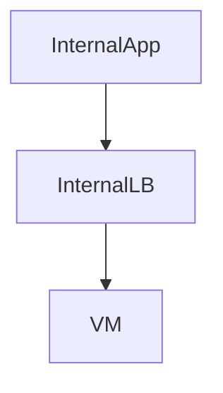

Public IP = attack surface.

---

# 3. Identity and Access Management (IAM)

## 3.1 Principle of Least Privilege

Only grant permissions that are required.

Bad:

- Giving Owner role to everyone

Good:

- Assign specific roles
- Use predefined roles

---

## 3.2 Service Accounts (Machine Identity)

VMs use service accounts to access GCP services.

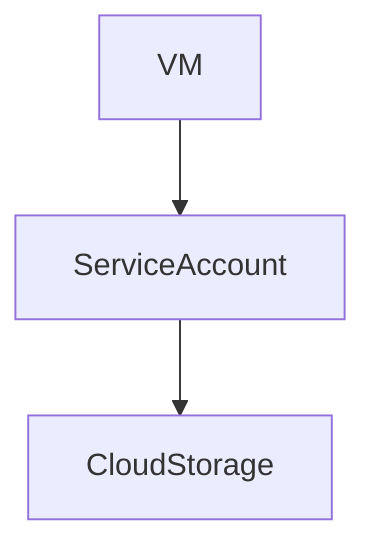

Best practices:

- Do not use default service account in production
- Create dedicated service accounts
- Assign minimal roles

---

## 3.3 OS Login (Recommended)

Instead of managing SSH keys manually:

Use OS Login:

- IAM-based SSH access
- Centralized user control
- Easier revocation

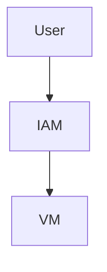

---

# 4. Metadata Server Security

Every VM has access to a metadata server at:

`http://metadata.google.internal`

It provides:

- Service account tokens
- Configuration
- Project info

If compromised:

- Attackers can access cloud APIs

---

## Best Practices

- Use least privilege service accounts
- Avoid running untrusted software
- Use firewall rules carefully
- Enable metadata concealment features (if applicable)

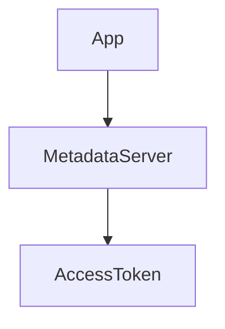

---

# 5. Shielded VMs

Shielded VMs protect against rootkits and boot-level attacks.

Features:

- Secure Boot
- Virtual TPM
- Integrity Monitoring

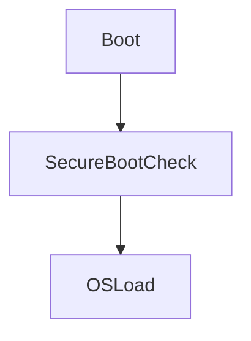

Best practice:

> Always enable Shielded VM unless incompatible.

---

# 6. Confidential VMs

Confidential VMs:

- Encrypt memory while in use
- Protect data from hypervisor-level attacks

Used in:

- High-security workloads
- Compliance-driven systems

Not required for beginners, but important to know.

---

# 7. OS Hardening Practices

Even after image selection and patching, you must harden the OS.

## 7.1 Keep OS Updated

- Patch regularly
- Use OS Patch Management

## 7.2 Disable Unnecessary Services

Example:

- Disable unused ports
- Remove unnecessary packages

## 7.3 Strong SSH Configuration

- Disable password authentication
- Use key-based login
- Rotate keys regularly

---

# 8. Disk Encryption

By default, GCP encrypts disks at rest.

Options:

- Google-managed keys (default)
- Customer-managed keys (CMEK)
- Customer-supplied keys (CSEK)

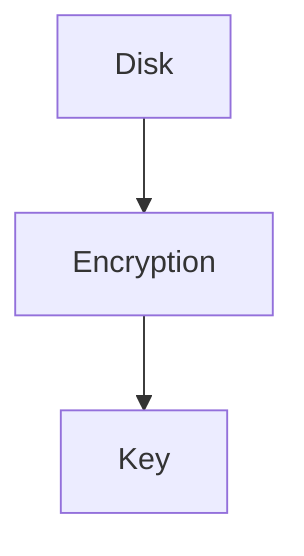

Beginner rule:

> Default encryption is sufficient for most workloads.

---

# 9. Logging and Monitoring (Security Visibility)

Security without monitoring = blind system.

Enable:

- Cloud Logging
- VM metrics
- Alerting policies

Monitor:

- CPU spikes
- Unauthorized SSH attempts
- Unexpected restarts

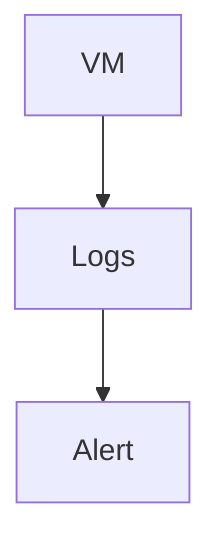

---

# 10. Protecting Against Common Threats

| Threat           | Protection             |
| ---------------- | ---------------------- |
| SSH brute force  | Restrict IPs, OS Login |
| DDoS             | Use load balancer      |
| VM compromise    | Autohealing MIG        |
| Data theft       | IAM + encryption       |
| Misconfiguration | Least privilege        |

---

# 11. Secure Production Architecture Example

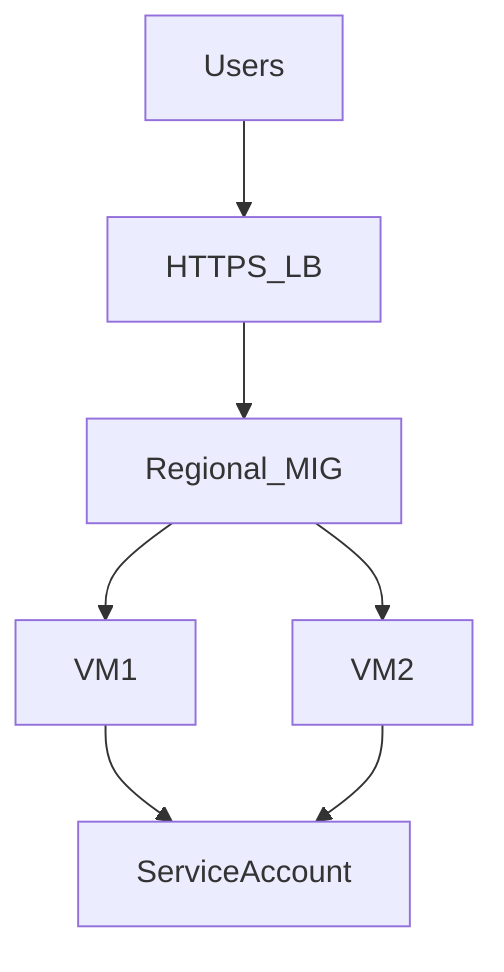

Security measures:

- No public SSH
- Regional MIG
- Health checks
- Autoscaling
- Shielded VMs
- Minimal IAM roles

---

# 12. Common Beginner Security Mistakes

- Opening all ports
- Leaving SSH open to world
- Using default service account everywhere
- Hardcoding credentials
- Ignoring patching
- No monitoring
- Running single public VM

---

# 13. Beginner Security Checklist

Before production:

- [ ] Firewall restricted
- [ ] No unnecessary external IPs
- [ ] OS Login enabled
- [ ] Shielded VM enabled
- [ ] Service accounts limited
- [ ] OS patched
- [ ] Monitoring enabled
- [ ] Load balancer configured
- [ ] Regional MIG used

---

# 14. Security Mental Model

Security is layered:

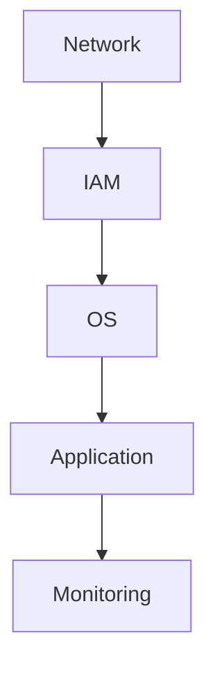

If one layer fails, others should still protect the system.

---

# 15. Final Takeaway

> **VM security is not a single setting — it is a combination of network, identity, OS, and operational discipline.**

If you apply:

- Least privilege
- Minimal exposure
- Regular patching
- Autoscaling + autohealing
- Monitoring

Your Compute Engine setup becomes **production-grade secure**.

---
