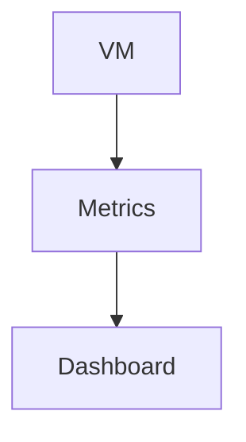
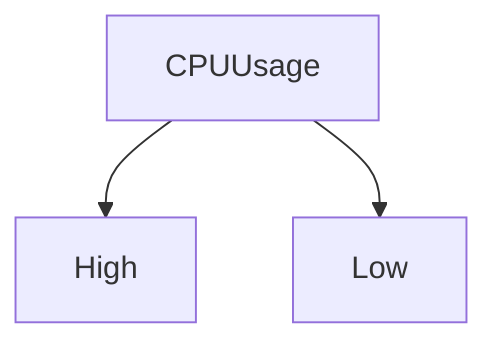
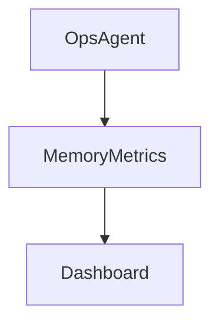
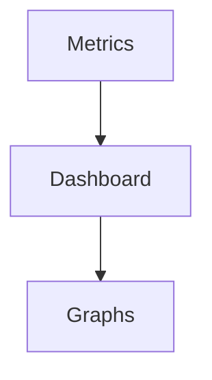
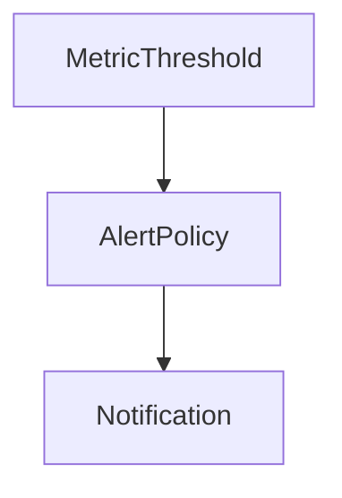
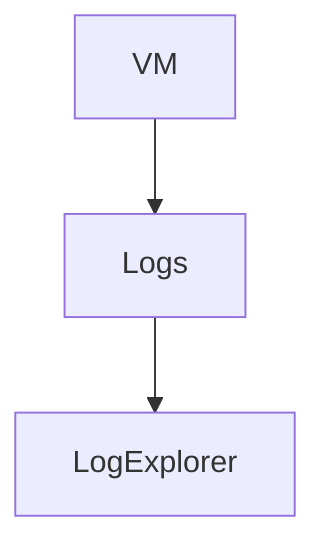
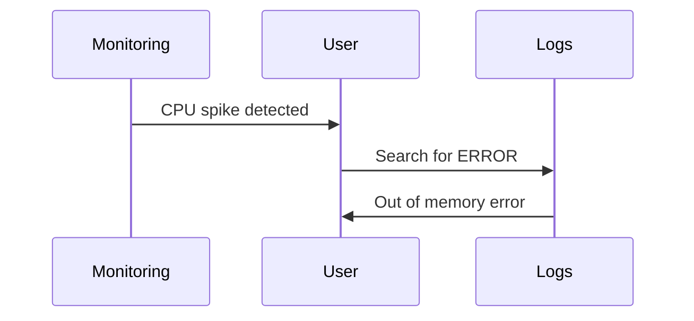
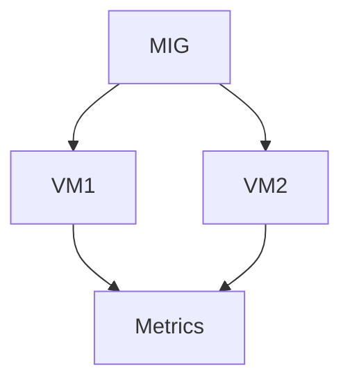
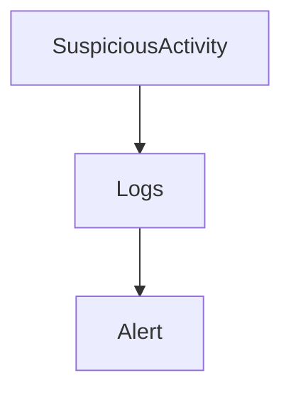
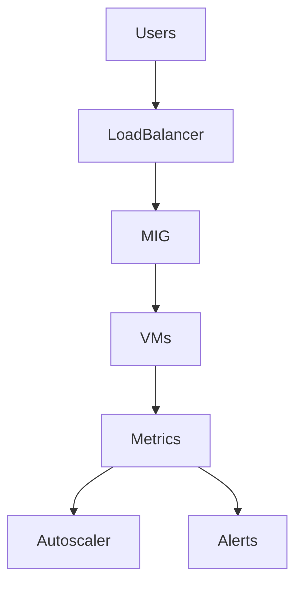

# Monitoring and Logging for Compute Engine

This document explains how to monitor and observe Virtual Machines (VMs) in **Google Cloud Platform** Compute Engine.

Monitoring and logging are critical because:

> You cannot fix what you cannot see.

Without monitoring:

- You won’t know when CPU is overloaded
- You won’t detect memory leaks
- You won’t notice failed requests
- You won’t know when a VM is compromised

This guide explains everything from first principles.

---

# 1. Monitoring vs Logging (Beginner Clarification)

Many beginners confuse these two.

| Concept    | What It Answers                |
| ---------- | ------------------------------ |
| Monitoring | “How is my system performing?” |
| Logging    | “What exactly happened?”       |

---

### Monitoring Example

- CPU usage = 85%
- Memory usage = 70%
- Disk usage = 40%

### Logging Example

- User login failed
- Application error thrown
- Service crashed

---

# 2. Core Tools Used in Compute Monitoring

Monitoring and logging are handled by:

- **Cloud Monitoring**
- **Cloud Logging**

These are part of Google Cloud’s observability stack.

---

# 3. Monitoring — Understanding VM Metrics

When a VM runs, it generates **metrics** automatically.

---

## 3.1 Default VM Metrics

Out of the box, you get:

- CPU utilization
- Network traffic
- Disk read/write
- Instance uptime

These help answer:

- Is my VM overloaded?
- Is traffic increasing?
- Is disk performance bottlenecked?

---

## 3.2 CPU Monitoring (Most Common)

CPU utilization shows how busy the VM is.

If CPU stays:

- Above 80% → consider scaling
- Below 10% → overprovisioned (wasting money)

---

## 3.3 Memory Monitoring

Memory metrics require the **Ops Agent** installed.

Without agent:

- No detailed memory usage data

With agent:

- RAM usage
- Swap usage
- Process-level visibility

---

# 4. Installing the Ops Agent (Important)

The Ops Agent enables:

- Detailed metrics
- Application logs
- System metrics

Without it:

- You only get basic monitoring

Best practice:

> Install Ops Agent on production VMs.

---

# 5. Creating Dashboards

Dashboards help visualize system health.

You can create:

- CPU graphs
- Network charts
- Disk I/O charts
- Uptime panels

This gives you:

> A visual health overview of your infrastructure.

---

# 6. Alerting (Very Important)

Monitoring without alerts is useless.

You should create alert policies for:

- High CPU
- Low disk space
- VM down
- Health check failures

Notifications can go to:

- Email
- Slack
- PagerDuty
- SMS

---

# 7. Logging — Understanding Logs

Logs answer:

> “What exactly happened inside the VM?”

---

## 7.1 Types of Logs

### 1. System Logs

- VM start/stop
- Kernel messages
- OS events

### 2. Application Logs

- API requests
- Errors
- User actions

### 3. Audit Logs

- IAM changes
- API calls
- Security events

---

# 8. Log Explorer

Log Explorer allows you to:

- Search logs
- Filter by severity
- Filter by VM
- Filter by time range

Example filters:

- `severity=ERROR`
- `resource.type="gce_instance"`

---

# 9. Example: Investigating a VM Crash

### Scenario

- VM restarted unexpectedly

Steps:

1. Check monitoring (CPU spike?)
2. Check logs (kernel panic?)
3. Check audit logs (manual restart?)

Root cause:

- Memory exhaustion

Solution:

- Increase RAM or autoscale

---

# 10. Monitoring in a MIG Setup

In production, monitoring happens at two levels:

You monitor:

- Individual VMs
- Overall group health
- Load balancer request rates
- Autoscaling activity

---

# 11. Logging and Security

Monitoring helps detect:

- Unauthorized SSH attempts
- Unexpected reboots
- High outbound traffic (data exfiltration)
- Failed login attempts

Security requires visibility.

---

# 12. Cost Considerations

Monitoring is generally low cost.

Logging:

- Charged based on data volume
- Retention affects cost

Best practices:

- Exclude unnecessary logs
- Use log retention policies

---

# 13. Beginner Best Practices Checklist

Before production:

- [ ] Install Ops Agent
- [ ] Create CPU alert
- [ ] Create disk usage alert
- [ ] Create uptime alert
- [ ] Monitor load balancer metrics
- [ ] Enable audit logs
- [ ] Review logs periodically

---

# 14. Monitoring + Autoscaling + Load Balancing (Complete Picture)

Monitoring feeds:

- Autoscaling decisions
- Alerting system
- Human operations

---

# 15. Final Takeaway

> **Running VMs without monitoring is like driving without a dashboard.**

Monitoring and logging transform Compute Engine from:

- “It seems to work”
  into
- “We know exactly how it’s behaving.”

---
