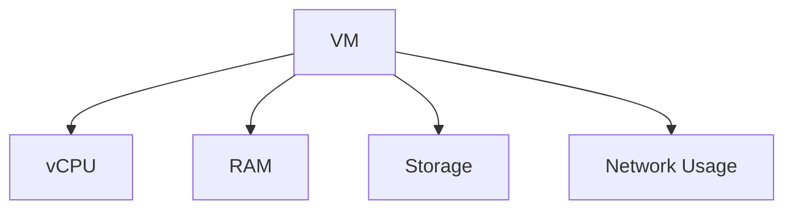
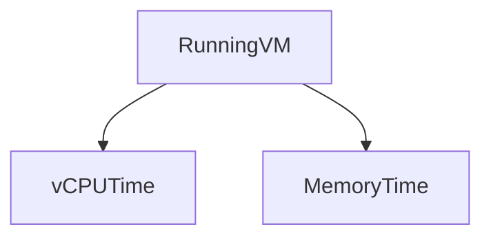
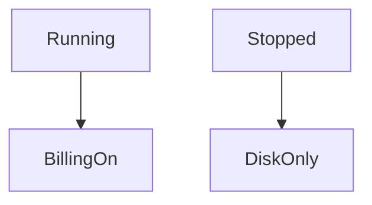
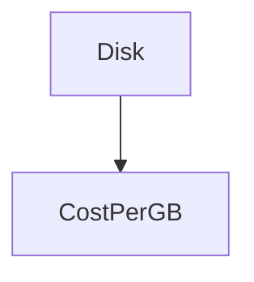
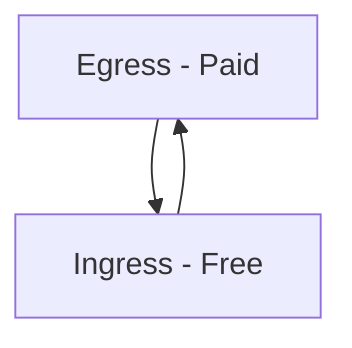
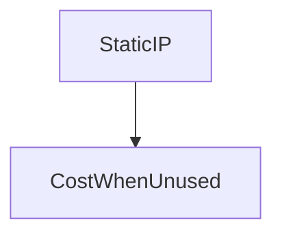
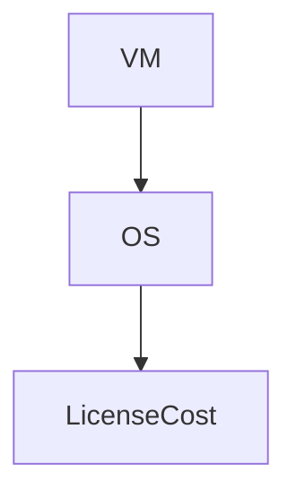
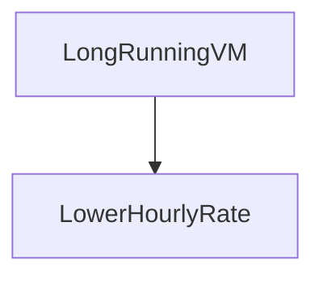
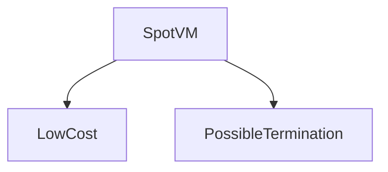
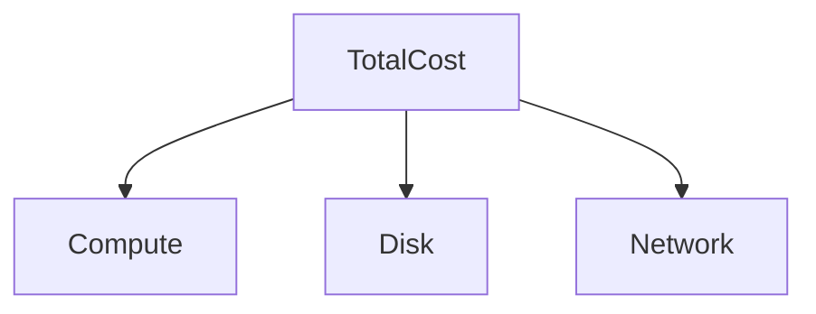

# Compute Pricing in Google Cloud Platform

This document explains **how pricing works for Compute Engine** in **Google Cloud Platform**.

Pricing can feel confusing because:

* You are billed for **multiple components**
* Pricing is **usage-based**, not fixed
* Costs depend on **how long** and **how intensely** resources run

This guide builds understanding from **first principles**.

---

## 1. The Core Idea of Compute Pricing

In GCP, you **do not pay for a “VM” as a single item**.

Instead, you pay for **individual resources** that together make up a VM.

> **Think of a VM like an electricity bill**
> You pay for what you use, not for owning the machine.

---

## 2. What You Pay For (High-Level)

For a Compute Engine VM, pricing has **four main components**:

1. **Compute (CPU + Memory)**
2. **Disk (Storage)**
3. **Network (Traffic)**
4. **Optional features (licenses, IPs, snapshots)**

---

## 3. Compute Cost (vCPU + Memory)

### What Is Charged?

You are billed for:

* vCPU time
* Memory (RAM) usage

Billing unit:

* **Per second**
* With a minimum runtime (e.g., 1 minute)

### Example

If a VM runs for:

* 2 vCPUs
* 8 GB RAM
* For 10 hours

You pay for:

* 2 vCPUs × 10 hours
* 8 GB RAM × 10 hours

---

## 4. What Happens When a VM Stops?

This is a **very important beginner concept**.

| VM State             | CPU Billing | Disk Billing        |
| -------------------- | ----------- | ------------------- |
| Running              | ✅ Yes       | ✅ Yes               |
| Stopped (terminated) | ❌ No        | ✅ Yes               |
| Suspended            | ❌ No        | ✅ Yes               |
| Deleted              | ❌ No        | ❌ (if disk deleted) |

> **Stopped VM ≠ Free VM**
> Storage still costs money.

---

## 5. Disk Pricing (Storage Cost)

Disks are billed:

* Per GB per month
* Independent of VM state

### Disk Types and Cost Intuition

| Disk Type      | Performance | Cost      |
| -------------- | ----------- | --------- |
| Standard (HDD) | Low         | Lowest    |
| Balanced SSD   | Medium      | Medium    |
| SSD            | High        | High      |
| Extreme SSD    | Very High   | Very High |

### Example

* 100 GB SSD disk
* VM stopped for entire month

👉 You **still pay** for 100 GB storage.

---

## 6. Boot Disk vs Data Disk Pricing

There is **no pricing difference** between:

* Boot disk
* Data disk

Pricing depends only on:

* Disk type
* Disk size
* Disk lifetime

---

## 7. Network Pricing (Often Overlooked)

### Types of Network Traffic

| Traffic Type         | Cost         |
| -------------------- | ------------ |
| Ingress (incoming)   | Free         |
| Egress (outgoing)    | Charged      |
| Internal (same zone) | Usually free |
| Cross-region         | Charged      |

### Example

* User downloads 10 GB from your VM
* You are charged for **10 GB egress**

---

## 8. External IP Address Pricing

| IP Type   | VM Running | VM Stopped  |
| --------- | ---------- | ----------- |
| Ephemeral | Free       | Released    |
| Static    | Free       | **Charged** |

**Beginner mistake:**
Leaving unused static IPs allocated.

---

## 9. OS Licensing Cost (Hidden but Important)

### Linux Images

* Ubuntu, Debian, Rocky, Alma
* **No extra cost**

### Paid OS Images

* Windows Server
* RHEL, SUSE

These include:

* OS license fee
* Billed per vCPU or per hour

---

## 10. Sustained Use Discounts (Automatic)

GCP rewards long-running VMs.

### How It Works

* VM runs longer in a month
* Per-hour price automatically drops
* No action required

**Beginner takeaway:**

> You do not need to “apply” for this discount.

---

## 11. Committed Use Discounts (Advanced Concept)

You commit to:

* 1 year or 3 years
* Specific CPU and memory usage

In return:

* Lower pricing (up to ~70%)

Used in:

* Production systems
* Predictable workloads

**Not recommended for beginners initially.**

---

## 12. Preemptible / Spot VMs (Cost-Saving Option)

### What They Are

* Very cheap VMs
* Can be terminated anytime by Google

### Use Cases

* Batch jobs
* CI/CD
* Testing
* Data processing

**Beginner rule:**

> Never run critical workloads on Spot VMs.

---

## 13. Example: Simple VM Cost Breakdown

### Scenario

* `e2-medium` VM
* 2 vCPU, 4 GB RAM
* 50 GB SSD disk
* Runs 24×7 for 30 days

### Cost Components

1. CPU + Memory → billed per second
2. Disk → billed per GB/month
3. Network → depends on usage
4. OS → free (Linux)

---

## 14. Cost Control Best Practices

* Stop unused VMs
* Delete unused disks
* Release unused static IPs
* Use E2 machines for learning
* Monitor billing dashboard
* Set budget alerts

---

## 15. Beginner Mental Model (Remember This)

* VM = multiple billable parts
* CPU + RAM → charged when running
* Disk → charged always
* Network out → charged
* Linux OS → free
* Everything is **pay-as-you-use**

---

## 16. Final Takeaway

> **Compute pricing is predictable once you understand the components — surprises only come from things you forgot were still running.**

---
