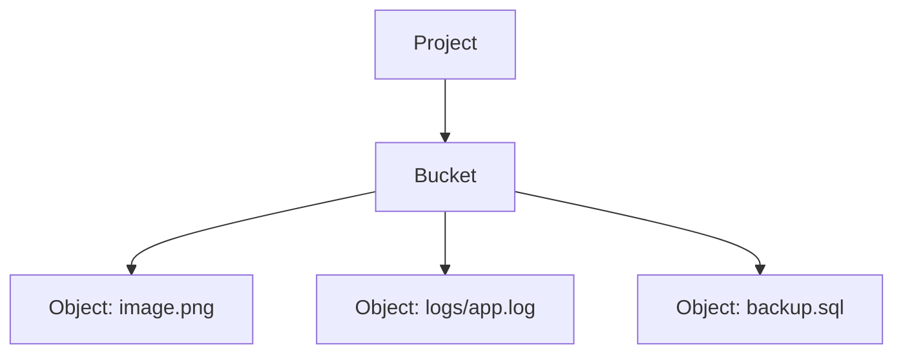
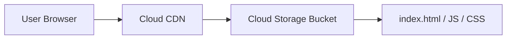
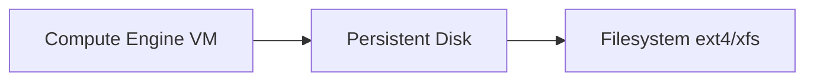
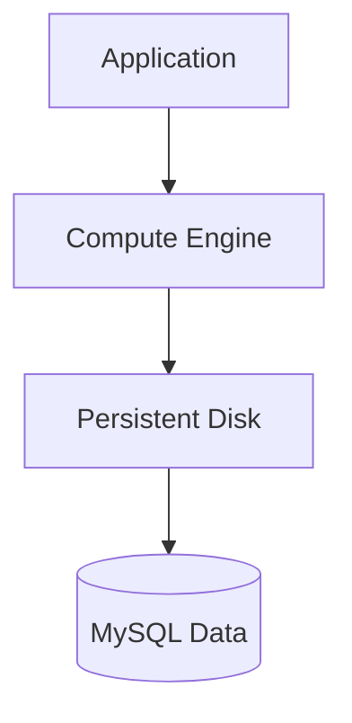
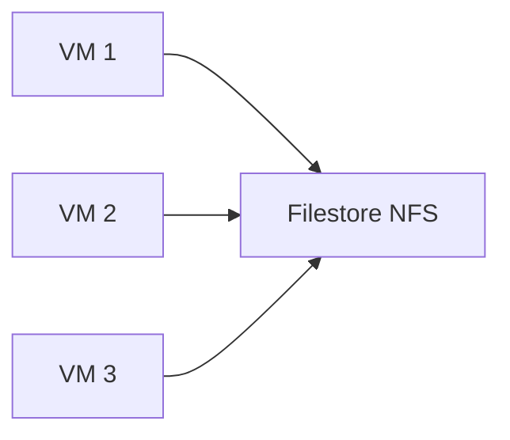
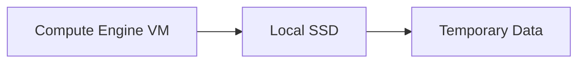
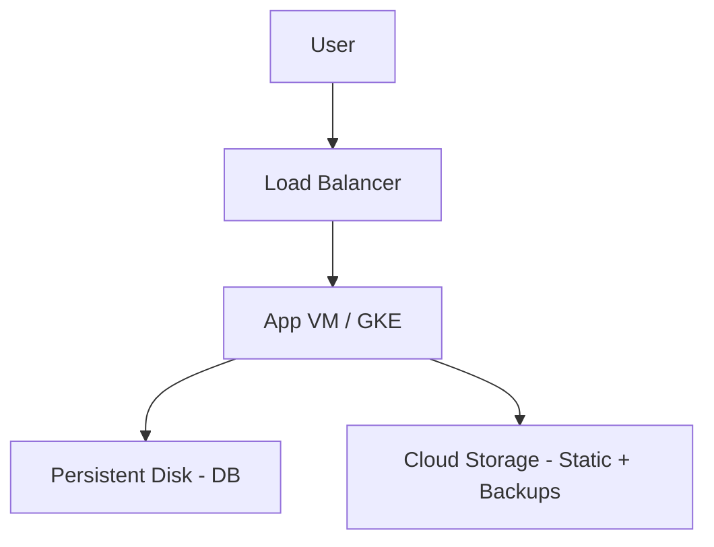
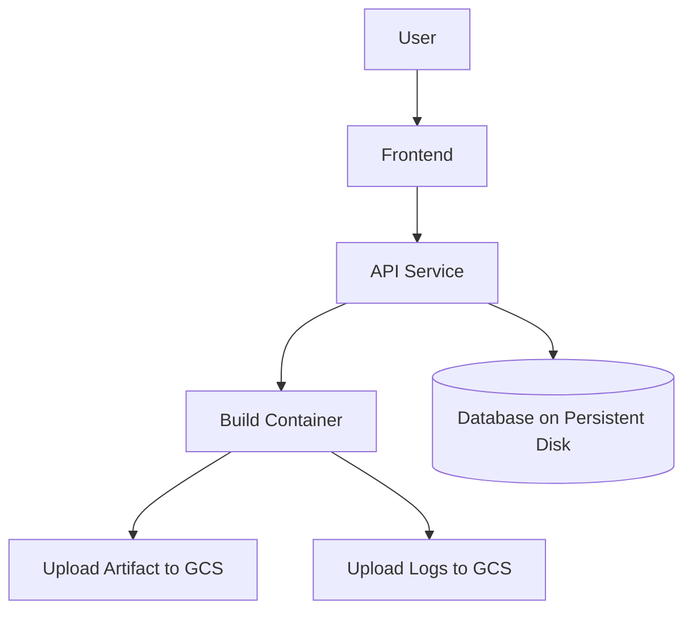

# Storage in Google Cloud Platform (GCP)

---

## 1. What is Cloud Storage?

Cloud storage means:

> Storing data on remote infrastructure managed by a cloud provider instead of storing it on your local machine or physical server.

Instead of this:

```
Your Laptop → Local Hard Disk
```

You get this:

```
Your Application → Internet → Cloud Storage Infrastructure
```

Cloud providers manage:

- Hardware
- Replication
- Durability
- Availability
- Scaling
- Backups (depending on service)

---

## 2. Why Do We Need Different Types of Storage?

Different workloads have different storage needs.

Examples:

| Workload                        | Storage Need   |
| ------------------------------- | -------------- |
| Store user profile images       | Object storage |
| Run MySQL database on VM        | Block storage  |
| Share files across multiple VMs | File storage   |
| Cache temporary data            | Local SSD      |

There is **no single storage type that fits everything**.

That’s why GCP provides multiple storage services.

---

## 3. Storage Categories in GCP

GCP storage can be divided into:

1. Object Storage
2. Block Storage
3. File Storage
4. Ephemeral (Temporary) Storage

---

## 4. Object Storage

### Google Cloud Storage



### What is Object Storage?

Object storage stores data as **objects inside buckets**.

Structure:

```
Project
   └── Bucket
         └── Object (file)
```

Each object contains:

- File data
- Metadata
- Unique ID

---

### Used For

- Images
- Videos
- Backups
- Static websites
- Logs
- Terraform state
- ML datasets

---

### Example

Static Website Hosting:



---

## 5. Block Storage

### Google Persistent Disk



### What is Block Storage?

Block storage provides raw disk volumes attached to a VM.

Inside the VM it looks like:

```
/dev/sda
/dev/sdb
```

You format it:

```
ext4
xfs
```

---

### Used For

- Operating system disk
- Database storage
- Application server storage
- High performance workloads

---

### Example

MySQL on Compute Engine:



---

## 6. File Storage

### Filestore



### What is File Storage?

Managed **NFS-based shared file system**.

Multiple VMs can mount the same storage.

---

### Characteristics

- Shared filesystem
- NFS-based
- Managed by GCP
- POSIX compliant

### Use Cases

- Legacy apps
- Lift-and-shift workloads
- Shared content storage
- GKE shared volumes

---

## 7. Ephemeral Storage

### Local SSD



### What is it?

Storage physically attached to VM host.

⚠ Data is lost when VM stops or restarts.

---

### Used For

- Caching
- Temporary processing
- High IOPS workloads
- Scratch space for analytics

---

## 8. Storage Architecture Comparison

| Feature            | Object        | Block           | File            | Local SSD |
| ------------------ | ------------- | --------------- | --------------- | --------- |
| Service            | Cloud Storage | Persistent Disk | Filestore       | Local SSD |
| Shared Across VMs  | Yes           | No (usually)    | Yes             | No        |
| Managed by Google  | Yes           | Yes             | Yes             | Partially |
| Survives VM Delete | Yes           | Yes             | Yes             | No        |
| Typical Use        | Static files  | OS / DB         | Shared app data | Cache     |

---

## 9. How to Choose Storage Type

Decision logic:

```
Is it file upload / static asset?
    → Cloud Storage

Is it database / OS disk?
    → Persistent Disk

Need shared file system?
    → Filestore

Need ultra fast temporary disk?
    → Local SSD
```

---

## 10. Where Storage Fits in Cloud Architecture

Example Full Architecture:



Another example (DevOps platform style):



---

## 11. Key Takeaways

- Cloud storage is not one thing.
- GCP offers specialized storage for different workloads.
- Choosing the wrong storage type can increase cost or reduce performance.
- Object storage is most common for modern cloud-native apps.
- Block storage is critical for compute workloads.
- File storage is for shared legacy-style workloads.
- Local SSD is for performance-critical temporary data.

---
