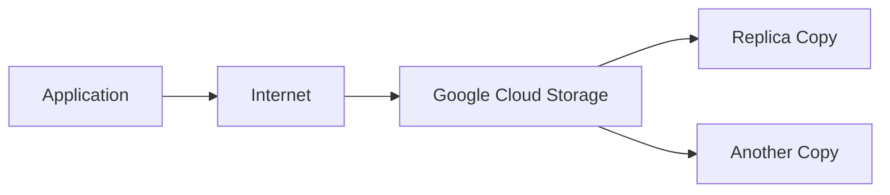
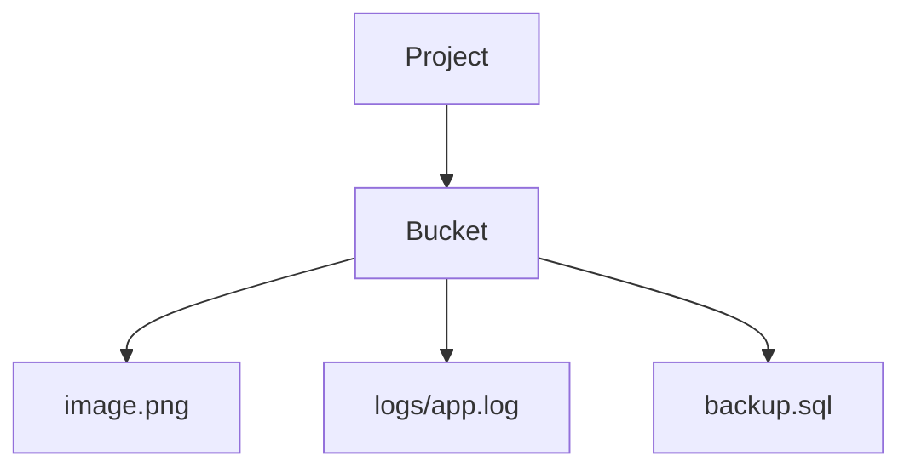
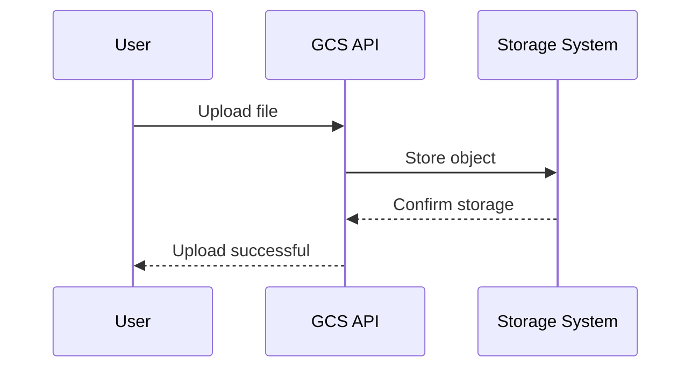
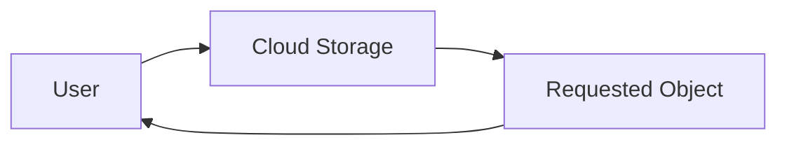

# Google Cloud Storage (GCS) – Basics

---

## 1. What is Google Cloud Storage?

Google Cloud Storage (GCS) is an object storage service provided by Google Cloud.

It allows you to store and retrieve:

- Files
- Images
- Videos
- Backups
- Logs
- Application artifacts
- Static website content

It is designed to be:

- Durable
- Scalable
- Secure
- Accessible over the internet

Cloud Storage is not a database and not a virtual disk.
It is a service for storing objects (files).

---

## 2. Why Do We Need Cloud Storage?

Before cloud storage:

```
Application → Local Disk → Server Crash → Data Lost
```

With Cloud Storage:



Cloud Storage solves major problems:

- Data durability (data is replicated)
- No hardware management
- No disk capacity planning
- Easy access from anywhere
- Offloads storage from compute instances

Instead of storing files inside your VM, you store them in Cloud Storage.

---

## 3. What Type of Storage is This?

Cloud Storage is **Object Storage**.

It does not use partitions or file systems like traditional disks.

Instead, it follows this structure:



Everything is stored as an object inside a bucket.

---

## 4. Core Concepts

Understanding these concepts is essential.

### Project

Every resource in GCP exists inside a project.

Cloud Storage buckets belong to a project.

---

### Bucket

A bucket is:

- A container for storing objects
- Globally unique in name
- The top-level resource in Cloud Storage

Example bucket names:

```
studybuddy-assets
autosage-build-artifacts
terraform-state-prod
```

You cannot create folders at the bucket level.
Folders are just part of the object name.

---

### Object

An object is the actual file stored in a bucket.

Example:

```
gs://studybuddy-assets/images/profile.png
```

An object consists of:

- File data
- Metadata (information about the file)
- A unique identifier

Objects are immutable.
If you change a file, you upload a new version.

---

## 5. How Cloud Storage Works (Beginner View)

When you upload a file:



Behind the scenes:

- The file is received by Google’s storage system
- It is stored across distributed infrastructure
- It is replicated for durability
- Metadata is maintained separately

When someone downloads the file:



Everything is accessed using HTTPS APIs.

---

## 6. Key Features of Cloud Storage

### High Durability

Data is stored across distributed infrastructure.
The probability of data loss is extremely low.

---

### Strong Consistency

After you upload a file:

- It is immediately available for reading
- It appears in listing operations immediately

---

### Automatic Scaling

There is:

- No disk size management
- No manual capacity provisioning
- No scaling configuration required

Storage grows automatically as you upload data.

---

### Secure Access

Access is controlled using:

- IAM roles
- Service accounts
- Signed URLs (temporary access links)

---

### Multiple Access Methods

You can access Cloud Storage using:

- HTTPS REST APIs
- gcloud CLI
- gsutil
- Client libraries (Python, Java, Node.js, etc.)

---

## 7. When Should You Use Cloud Storage?

Use Cloud Storage when:

- You need to store files generated by applications
- You need static website hosting
- You need to store backups
- You need to store logs
- You need globally accessible storage
- You need scalable file storage

Do not use Cloud Storage when:

- You need a database
- You need a traditional filesystem mounted to a VM
- You need a boot disk for a virtual machine

---

## 8. Summary

Google Cloud Storage is a scalable, durable, and secure object storage service.

It stores data as:

```
Project → Bucket → Object
```

It is best suited for:

- Static assets
- Backups
- Logs
- Artifacts
- File storage for cloud-native applications

---
