# Google Cloud Storage (GCS) – Deep Dive

---

## 1. Introduction

Google Cloud Storage (GCS) is a fully managed, highly scalable, durable object storage service.

This document covers advanced and important concepts including:

- Storage classes
- Bucket location types
- Versioning
- Lifecycle management
- Retention policies
- Object metadata
- Class A and Class B operations
- Access control models
- Performance considerations
- Signed URLs
- Cost-impacting behaviors

---

## 2. Storage Classes

Storage classes define **cost structure and minimum storage duration**, not performance (all classes provide millisecond access).

### Available Storage Classes

| Class    | Designed For                        | Minimum Storage Duration |
| -------- | ----------------------------------- | ------------------------ |
| Standard | Frequently accessed data            | None                     |
| Nearline | Accessed less than once per month   | 30 days                  |
| Coldline | Accessed less than once per quarter | 90 days                  |
| Archive  | Rarely accessed data                | 365 days                 |

### Conceptual Model

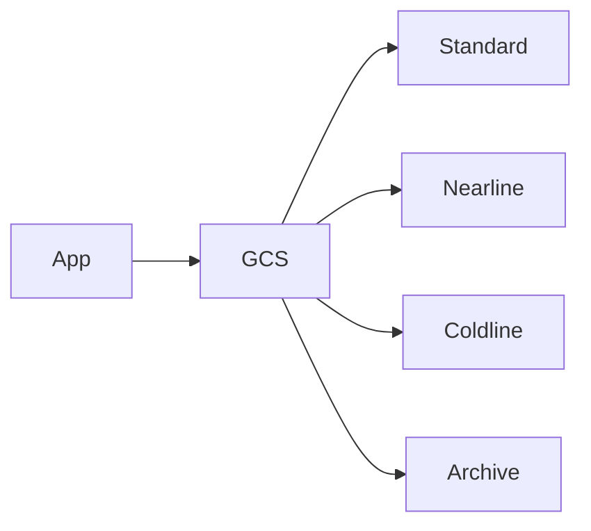

### Important Notes

- Retrieval speed is similar across classes.
- Early deletion fees apply if data is deleted before minimum duration.
- Archive is cheapest for long-term storage.

---

## 3. Bucket Location Types

When creating a bucket, you must choose a location type.

### Regional

Data stored in a single region.

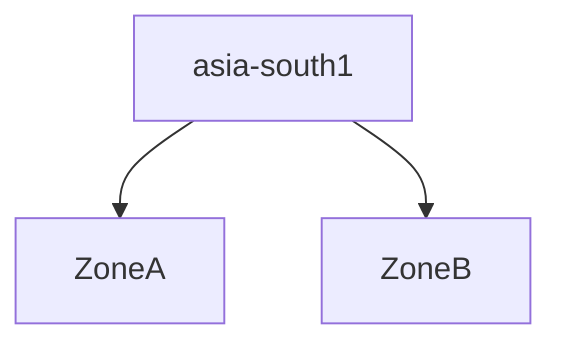

### Dual-Region

Data replicated across two selected regions.

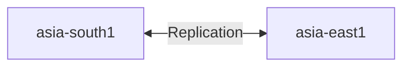

### Multi-Region

Data automatically distributed across multiple regions in a continent.

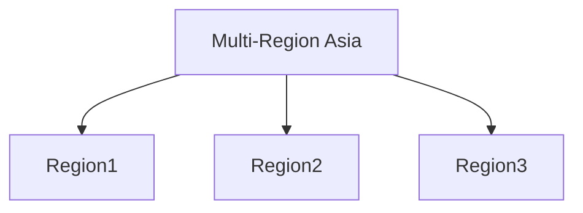

### Choosing Location

- Latency-sensitive apps → Regional
- High availability across regions → Dual-region
- Global access patterns → Multi-region

---

## 4. Object Versioning

Versioning allows you to keep older versions of an object.

When enabled:

- Overwriting an object does not delete the old one.
- Old versions become non-current objects.

### Without Versioning

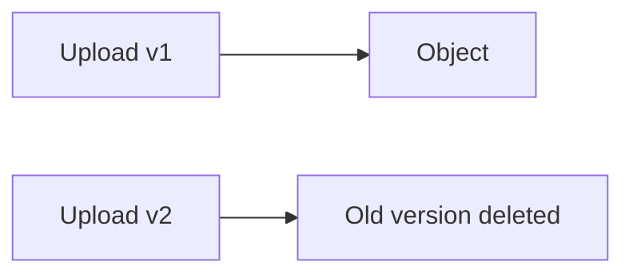

### With Versioning Enabled

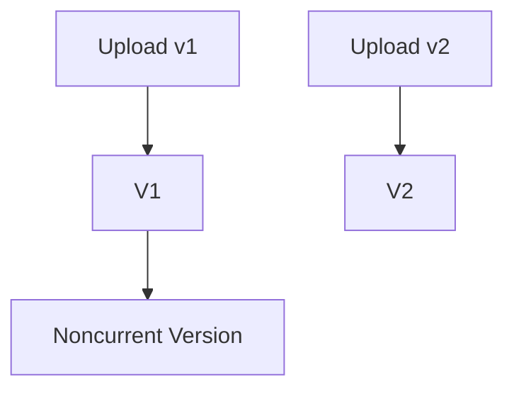

### Use Cases

- Accidental deletion protection
- Rollback capability
- Audit requirements

### Important

Storage charges apply to all versions.

---

## 5. Lifecycle Management

Lifecycle rules automatically transition or delete objects based on conditions.

### Example Rule

- Move to Coldline after 30 days
- Delete after 365 days

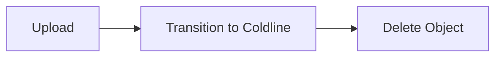

### Common Conditions

- Age of object
- Storage class
- Number of newer versions
- Custom time

Lifecycle management reduces manual operations and cost.

---

## 6. Retention Policies

Retention policies prevent deletion of objects for a fixed duration.

Example:

- Retention period: 365 days
- Object cannot be deleted before that period ends

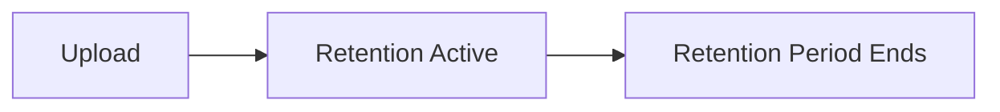

Used for:

- Compliance
- Regulatory requirements
- Audit controls

Retention policy can be locked permanently.

---

## 7. Object Metadata

Each object has metadata:

### System Metadata

- Object size
- Content type
- Creation time
- Storage class
- Generation number

### Custom Metadata

You can define key-value pairs.

Example:

```json
{
  "env": "production",
  "team": "devops"
}
```

Metadata can influence caching and lifecycle rules.

---

## 8. Access Control Models

Cloud Storage supports two models:

### Uniform Bucket-Level Access (Recommended)

Access controlled only via IAM roles.

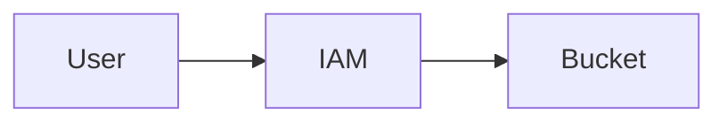

### Fine-Grained (Object ACLs)

Access controlled at object level.

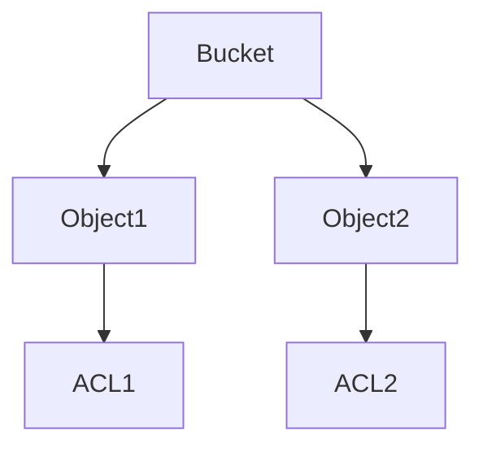

Uniform access simplifies security management.

---

## 9. Class A and Class B Operations

Operations in Cloud Storage are billed differently.

### Class A Operations (Higher Cost)

- Object uploads
- Object rewrites
- Object copies
- Object listing
- Bucket creation
- Changing metadata

### Class B Operations (Lower Cost)

- Object read (GET)
- Metadata retrieval
- Checking object existence

### Conceptual View

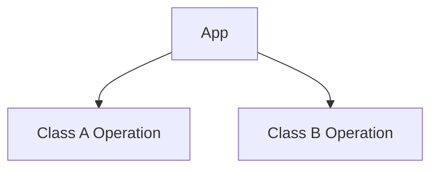

### Why This Matters

High-frequency listing or metadata operations can increase costs significantly.

Example:

- CI pipeline repeatedly listing large buckets → Cost impact.

---

## 10. Signed URLs

Signed URLs provide temporary access to private objects.

Use case:

- Share private file with limited-time access.

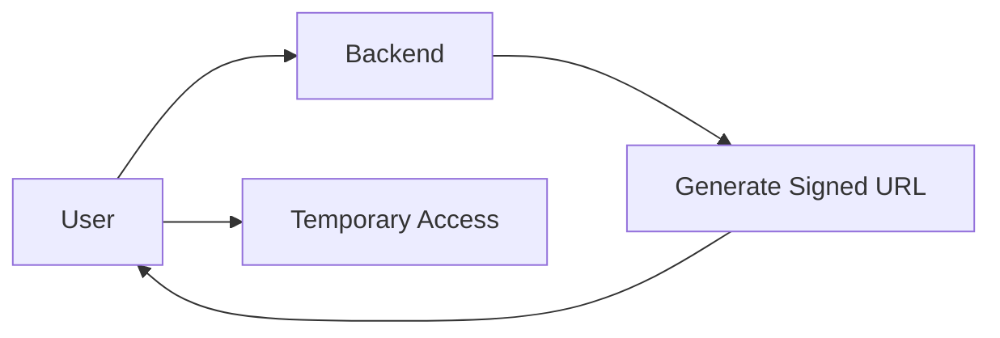

Benefits:

- No need to make bucket public
- Secure time-limited sharing

---

## 11. Performance Considerations

### Request Rate Scaling

Cloud Storage automatically scales request handling.

Best practice:

- Avoid sequential object naming like:
  - file1
  - file2
  - file3

Use randomized or hashed prefixes for high throughput systems.

### Large Object Uploads

Use resumable uploads for:

- Large files
- Unstable networks

---

## 12. Consistency Model

Cloud Storage provides strong consistency:

- Read-after-write consistency
- Strong object listing consistency

Once uploaded, objects are immediately visible.

---

## 13. Encryption

By default:

- Data encrypted at rest
- Data encrypted in transit (HTTPS)

Optional:

- Customer-managed encryption keys (CMEK)
- Customer-supplied encryption keys (CSEK)

---

## 14. Common Architecture Patterns

### Static Website Hosting

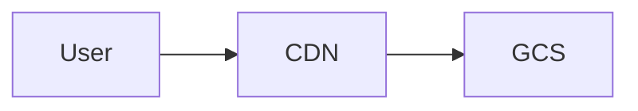

### Backup Architecture

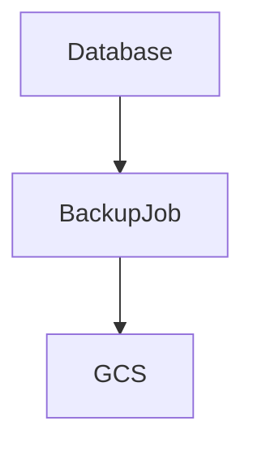

### Artifact Storage

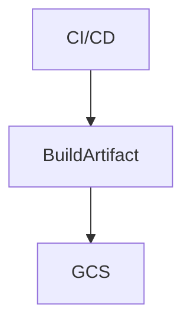

---

## 15. Summary

Google Cloud Storage provides:

- Durable object storage
- Multiple storage classes
- Flexible location types
- Versioning and lifecycle automation
- Strong consistency
- Granular cost model (Class A & B operations)
- Secure access mechanisms
- High scalability

Understanding:

- Storage classes
- Location strategy
- Operation billing
- Lifecycle rules
- Versioning behavior

is critical for building cost-efficient and scalable architectures.
