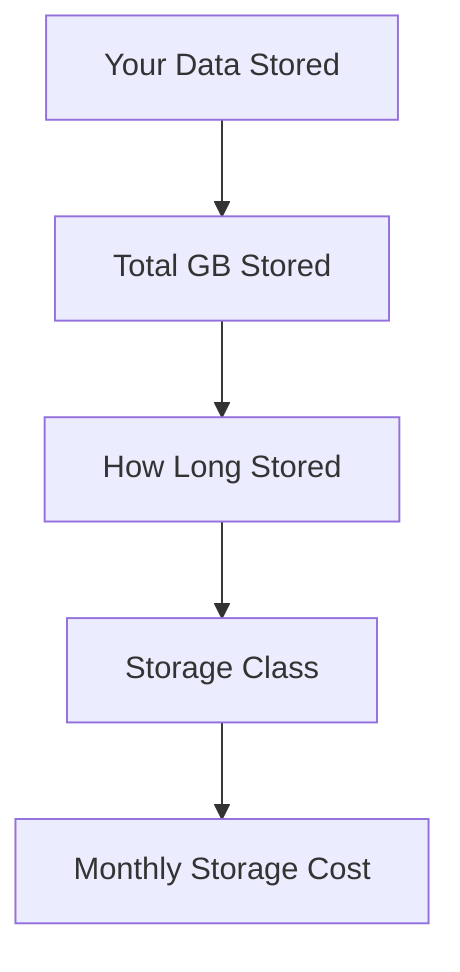
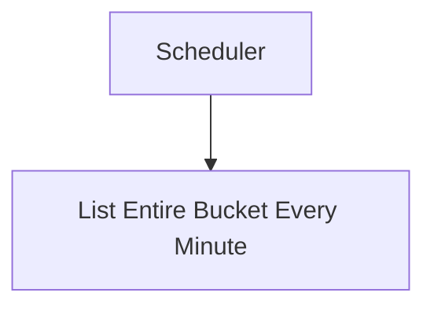
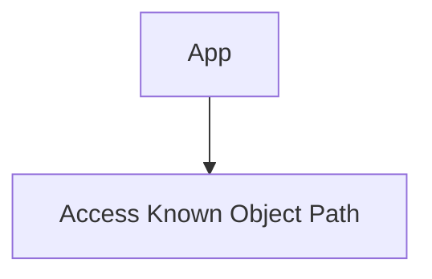
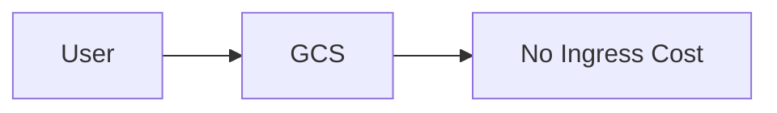
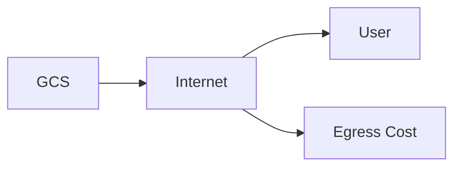
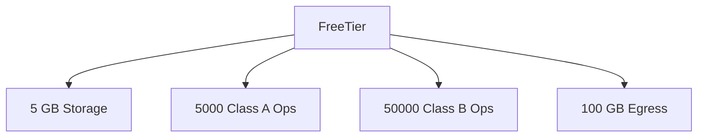
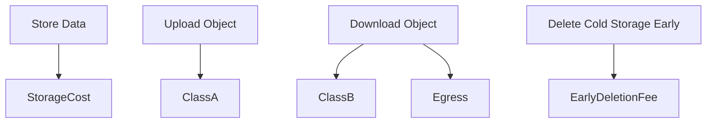

# Google Cloud Storage (GCS) – Pricing Explained

---

## 1. Introduction

Google Cloud Storage pricing is based on **how much you store, how often you access it, and where the data moves**.

Cloud Storage pricing is divided into four major components:

1. Storage (per GB per month)
2. Operations (Class A & Class B)
3. Network usage (Egress)
4. Retrieval and early deletion charges

Understanding these four pillars is critical for cost control.

---

## 2. Storage Pricing (Per GB Per Month)

You are charged based on:

- Storage class
- Location type
- Amount of data stored
- Duration of storage

### Conceptual View



### Example

If you store:

- 100 GB in Standard storage
- For 1 month

You pay:

```
100 GB × price_per_GB_of_Standard
```

If you store 100 GB for 15 days:

You pay roughly half the monthly cost.

---

## 3. Storage Classes and Pricing Impact

Each storage class has:

- Different per-GB storage cost
- Minimum storage duration
- Different retrieval pricing

| Storage Class | Storage Cost | Minimum Duration |
| ------------- | ------------ | ---------------- |
| Standard      | Highest      | None             |
| Nearline      | Lower        | 30 days          |
| Coldline      | Lower        | 90 days          |
| Archive       | Lowest       | 365 days         |

Important:
Even though Archive is cheapest per GB, deleting it before 365 days results in early deletion charges.

---

## 4. Operations Pricing (Class A and Class B)

Cloud Storage charges per API operation.

There are two main categories:

### Class A Operations (Higher Cost)

These include:

- Upload object
- Rewrite object
- Copy object
- List objects in bucket
- Change metadata
- Create bucket

### Class B Operations (Lower Cost)

These include:

- Read object (GET)
- Retrieve metadata
- Check if object exists

---

### Conceptual Example

```mermaid
flowchart LR
    App --> Upload[Upload File<br>(Class A)]
    App --> Read[Download File<br>(Class B)]
```

If your app:

- Uploads 1,000 files → 1,000 Class A operations
- Downloads 10,000 files → 10,000 Class B operations

Each operation type has separate pricing per 10,000 requests.

---

### Why This Matters

A badly designed system that repeatedly lists a large bucket can generate high Class A costs.

Example bad design:



Better design:



Avoid excessive listing.

---

## 5. Network Pricing (Egress Charges)

Network pricing depends on where data moves.

### Ingress (Uploading Data)

Uploading data into Cloud Storage is free.



---

### Egress (Downloading Data)

You are charged when data leaves Google’s network.

Examples:

- Download to internet
- Transfer to another cloud provider
- Transfer to on-premises



---

### Internal GCP Transfers

Cost depends on:

- Same region
- Different region
- Same multi-region

Example:

- GCS (asia-south1) → VM (asia-south1) → usually free
- GCS (asia-south1) → VM (us-central1) → charged

---

## 6. Retrieval Fees

For Nearline, Coldline, and Archive:

You pay retrieval charges when you read data.

Example:

- 100 GB in Archive
- You download 10 GB
- Retrieval charge applies to 10 GB

Standard storage has no retrieval fee.

---

## 7. Early Deletion Charges

Each cold storage class has minimum storage duration.

If you delete early:

You are charged as if you stored it for the full minimum duration.

Example:

- Coldline minimum duration = 90 days
- You delete after 30 days
- You still pay remaining 60 days equivalent

---

## 8. Free Tier and Always Free

Google Cloud provides Always Free usage under specific limits.

### Always Free Storage

Available only in specific US regions.

Includes:

- 5 GB Standard storage (regional, US only)
- 5,000 Class A operations per month
- 50,000 Class B operations per month
- 100 GB network egress to North America per month

Important:

- Only applies to specific regions
- Only Standard storage
- Subject to change by Google

---

### Conceptual Always Free Usage



If you exceed these limits, normal pricing applies.

---

## 9. Example Cost Scenarios

### Scenario 1 – Small Static Website

- 2 GB stored
- 10,000 downloads per month
- Standard storage

Costs:

- Storage cost (2 GB)
- Class B operations (downloads)
- Possibly minimal egress

Likely within free tier if in US region.

---

### Scenario 2 – Backup Storage

- 500 GB stored in Archive
- No access for 1 year

Cost:

- Very low storage cost
- No retrieval cost (if not accessed)
- No operation cost (minimal)

Archive is ideal here.

---

### Scenario 3 – CI/CD Artifact Storage

- 100 builds per day
- 100 uploads per day
- Frequent listing of bucket

Costs:

- High Class A operations
- Storage cost
- Possibly lifecycle transitions

Optimizing lifecycle reduces long-term cost.

---

## 10. Full Pricing Flow



Total Monthly Cost =

Storage + Operations + Egress + Retrieval + Early Deletion

---

## 11. Cost Optimization Best Practices

1. Choose correct storage class.
2. Use lifecycle rules to auto-transition old data.
3. Avoid unnecessary list operations.
4. Minimize cross-region transfers.
5. Keep compute and storage in same region.
6. Monitor usage via billing reports.

---

## 12. Key Takeaways

Cloud Storage pricing depends on:

- How much data you store
- How often you access it
- What type of operations you perform
- Where the data moves

Most beginners underestimate:

- Class A operation costs
- Egress charges
- Early deletion fees

Designing storage architecture correctly can significantly reduce cost.

For more information, see [GCP Cloud Storage Pricing](https://cloud.google.com/storage/pricing).

---
