# GCS – Storage Classes and Lifecycle Management

---

## 1. Introduction

Google Cloud Storage (GCS) allows you to store objects in different **storage classes**.

Storage classes help you:

- Optimize cost
- Match storage to access patterns
- Automate transitions as data ages

Choosing the correct storage class is one of the most important cost decisions in Cloud Storage.

---

## 2. What Are Storage Classes?

A storage class defines:

- Cost per GB per month
- Minimum storage duration
- Retrieval charges

All storage classes provide:

- Millisecond access
- High durability
- Strong consistency

The main difference is **cost structure**, not performance.

---

## 3. Available Storage Classes

| Storage Class | Best For                            | Minimum Storage Duration |
| ------------- | ----------------------------------- | ------------------------ |
| Standard      | Frequently accessed data            | None                     |
| Nearline      | Accessed less than once per month   | 30 days                  |
| Coldline      | Accessed once per quarter or less   | 90 days                  |
| Archive       | Rarely accessed (long-term storage) | 365 days                 |

---

## 4. Understanding Each Storage Class

### 4.1 Standard Storage

Use when:

- Data is accessed frequently
- You need active files
- Static websites
- Application assets
- Active datasets

Example:

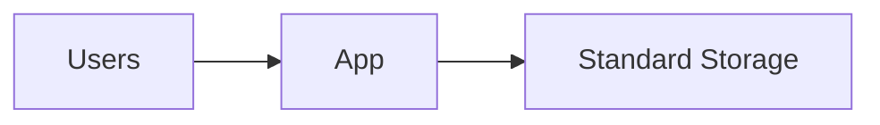

No minimum storage duration.
No retrieval fee.

Higher storage cost compared to others.

---

### 4.2 Nearline Storage

Use when:

- Data is accessed about once a month
- Monthly backups
- Archived reports

Minimum storage duration: 30 days.

If deleted before 30 days, early deletion charges apply.

Example:

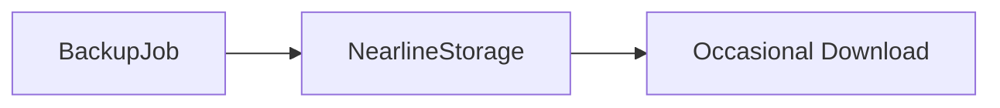

Lower storage cost than Standard.
Small retrieval cost when reading data.

---

### 4.3 Coldline Storage

Use when:

- Data is accessed rarely (quarterly or less)
- Disaster recovery backups
- Long-term retention with occasional access

Minimum storage duration: 90 days.

Example:

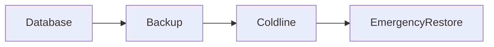

Even lower storage cost.
Higher retrieval cost than Nearline.

---

### 4.4 Archive Storage

Use when:

- Data is almost never accessed
- Compliance archives
- Long-term legal storage

Minimum storage duration: 365 days.

Example:

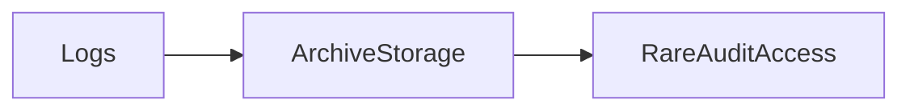

Lowest storage cost.
Highest retrieval cost.
Early deletion fees if removed before 1 year.

---

## 5. Comparing Storage Classes

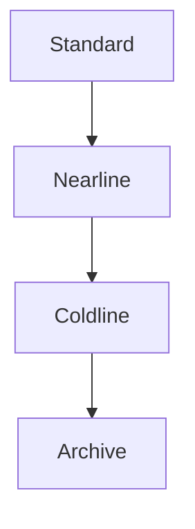

As you move downward:

- Storage cost decreases
- Minimum duration increases
- Retrieval cost increases

---

## 6. How to Choose the Right Storage Class

Ask these questions:

1. How often will the data be accessed?
2. How long will the data be stored?
3. Is immediate access required?
4. Is this for compliance or archival?

### Decision Flow

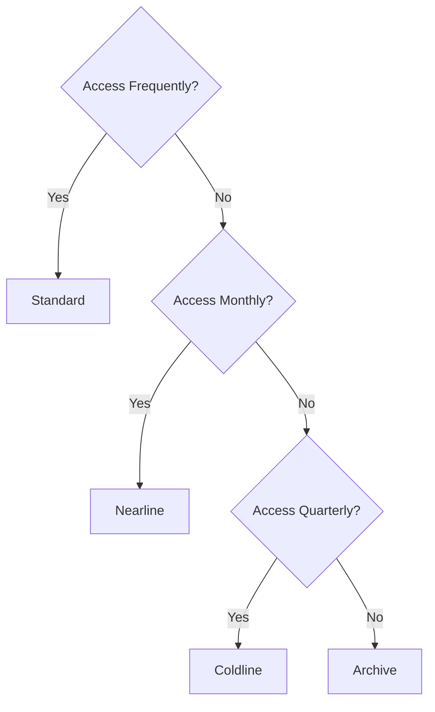

---

## 7. What is Lifecycle Management?

Lifecycle management automatically:

- Changes storage class
- Deletes objects
- Manages old versions

Based on rules you define.

Instead of manually moving data, you define a policy.

---

## 8. Why Lifecycle Rules Are Important

Without lifecycle:

You may overpay for old data.

With lifecycle:

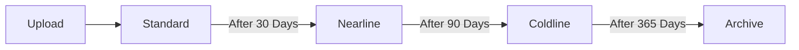

Costs reduce automatically over time.

---

## 9. Lifecycle Rule Components

A lifecycle rule has two parts:

1. Condition
2. Action

### Example Rule

Condition:

- Object age = 30 days

Action:

- Change storage class to Nearline

---

## 10. Common Lifecycle Conditions

You can define rules based on:

- Age (number of days since creation)
- Storage class
- Number of newer versions
- Custom time
- Created before a specific date

Example:

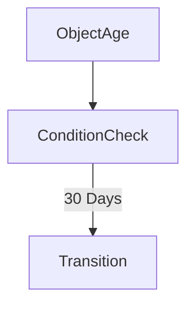

---

## 11. Lifecycle Actions

Available actions:

- Set storage class (transition)
- Delete object

---

### Example: Auto Delete Old Logs

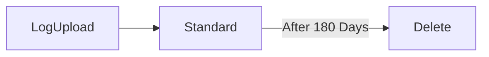

This is useful for:

- Log rotation
- Temporary datasets
- Reducing storage cost

---

## 12. Lifecycle Example – Backup Strategy

Imagine:

- Daily backups
- Rarely accessed after 1 month
- Deleted after 1 year

Lifecycle flow:

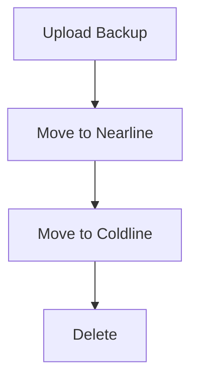

This ensures:

- Lower cost over time
- Automatic cleanup
- No manual intervention

---

## 13. Interaction with Versioning

If versioning is enabled:

Lifecycle rules can:

- Delete old versions
- Retain recent versions
- Transition noncurrent versions to cheaper storage

Example:

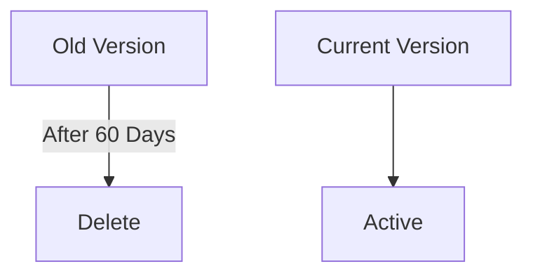

Versioning + lifecycle together create powerful data protection strategies.

---

## 14. Autoclass (Automatic Optimization)

Autoclass automatically moves objects between:

- Standard
- Nearline
- Coldline

Based on access patterns.

It simplifies lifecycle management for beginners.

Archive is not automatically included in Autoclass.

---

## 15. Summary

Storage classes help you:

- Optimize cost
- Match storage to access frequency
- Control long-term storage expenses

Lifecycle management helps you:

- Automate transitions
- Reduce manual work
- Prevent overpaying for old data

Choosing the right storage class and configuring lifecycle rules correctly is one of the most powerful cost-optimization strategies in Google Cloud Storage.

---
