# GCS – Bucket Configuration and Management

---

## 1. Introduction

In Google Cloud Storage, a **bucket** is the primary container used to store objects (files).

Every object stored in Cloud Storage must belong to a bucket.

You can think of a bucket as a **top-level storage container** where files are organized and managed.

Basic structure:

```text
Project → Bucket → Object
```

Example object path:

```text
gs://studybuddy-assets/images/profile.png
```

Where:

- `studybuddy-assets` → bucket
- `images/profile.png` → object path

---

## 2. Bucket Architecture

A bucket contains objects and metadata.

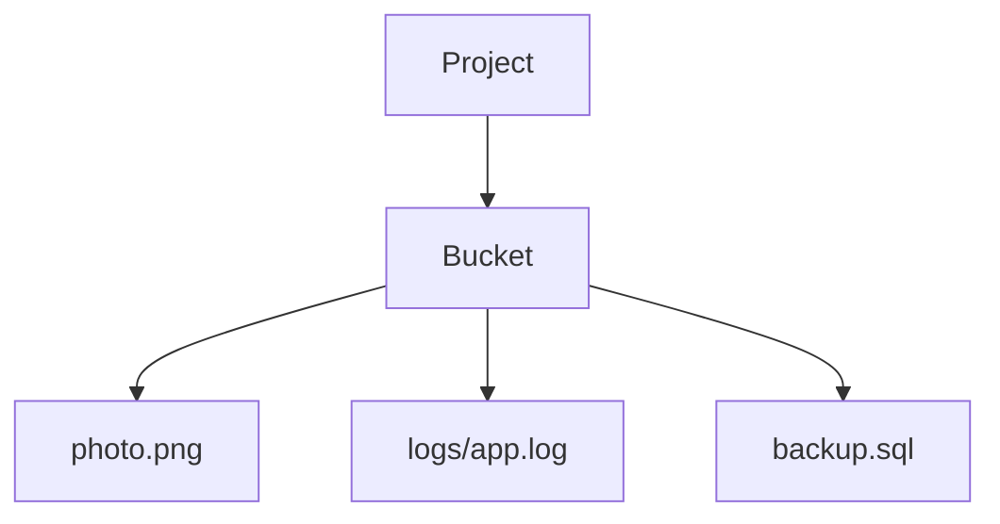

Important characteristics of buckets:

- Buckets are **global namespace resources**
- Bucket names must be **unique worldwide**
- A bucket belongs to **one project**
- Buckets store **unlimited objects**

---

## 3. Bucket Naming Rules

Bucket names must follow strict rules.

### Naming Requirements

- Must be globally unique
- Length: **3–63 characters**
- Lowercase letters only
- Can include numbers and hyphens
- Must start and end with a letter or number

Allowed examples:

```text
webapp-assets
service-backups
project-logs-2026
```

Invalid examples:

```text
MyBucket
bucket_with_underscores
.bucket
```

---

### Why Global Uniqueness Matters

Bucket names are used as part of the URL.

Example:

```text
https://storage.googleapis.com/studybuddy-assets/image.png
```

Because they are publicly addressable, the name must be globally unique.

---

## 4. Bucket Locations

When creating a bucket, you must choose a **location**.

This determines where the data is physically stored.

There are three types:

- Regional
- Dual-region
- Multi-region

---

### Regional Buckets

Data stored in one region.

Example: `asia-south1`

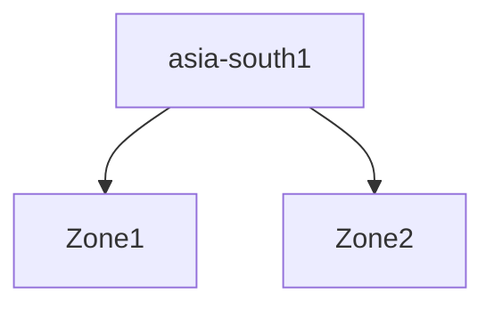

Best for:

- Low latency applications
- Data locality requirements
- Compute in same region

---

### Dual-Region Buckets

Data replicated across two specific regions.

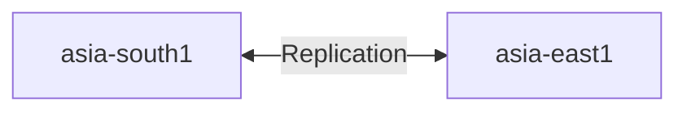

Best for:

- High availability
- Disaster recovery
- Regional outages

---

### Multi-Region Buckets

Data distributed across multiple regions within a continent.

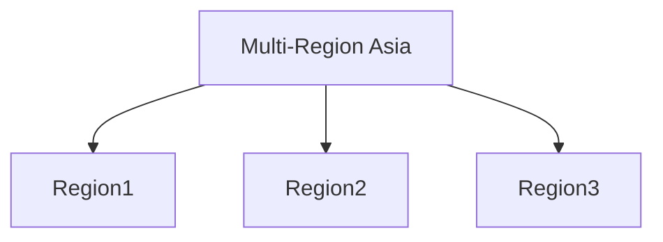

Best for:

- Global applications
- Content delivery
- High availability

---

## 5. Bucket Storage Class

When creating a bucket, you choose a **default storage class**.

Examples:

- Standard
- Nearline
- Coldline
- Archive

This class applies to objects uploaded to the bucket unless overridden.

Example flow:

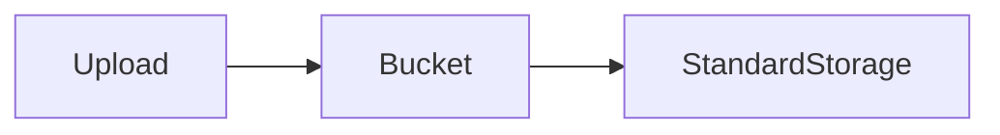

Objects can later transition to different classes using lifecycle rules.

---

## 6. Uniform Bucket-Level Access

Cloud Storage supports two access models:

1. Uniform bucket-level access (recommended)
2. Fine-grained access control

---

### Uniform Bucket-Level Access

Permissions are managed only through IAM.

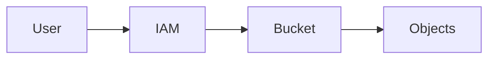

Advantages:

- Simpler management
- Consistent security
- Recommended by Google

---

### Fine-Grained Access (Legacy)

Permissions can be set per object.

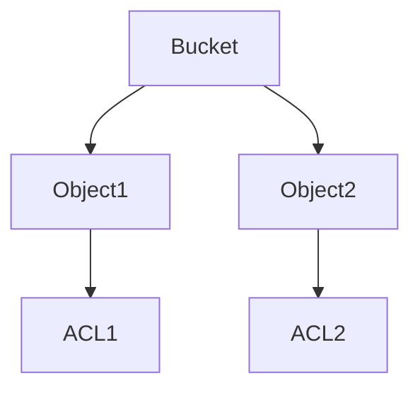

Disadvantages:

- Harder to manage
- More complex security model

---

## 7. Public Access Prevention

Buckets can accidentally expose data publicly.

To prevent this, Cloud Storage supports **Public Access Prevention**.

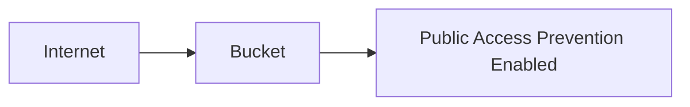

When enabled:

- Public IAM roles are blocked
- Objects cannot be publicly accessible

This is important for sensitive data.

---

## 8. Bucket Labels

Labels allow you to attach metadata to buckets.

Example:

```text
environment: production
team: devops
project: autosage
```

Benefits:

- Organizing resources
- Cost tracking
- Filtering in console

Example diagram:

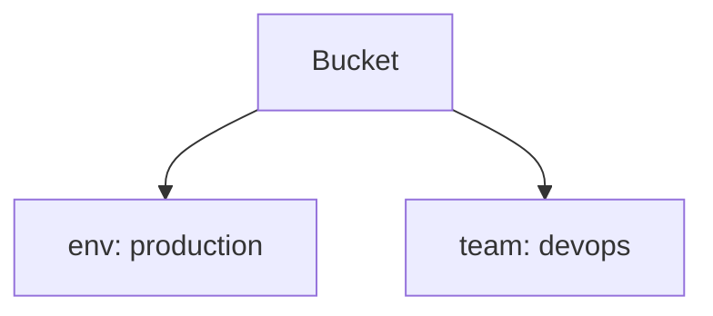

---

## 9. Object Organization in Buckets

Cloud Storage does **not actually have folders**.

Folders are simulated using object naming.

Example objects:

```text
images/profile.png
images/banner.png
logs/app.log
```

Console view:

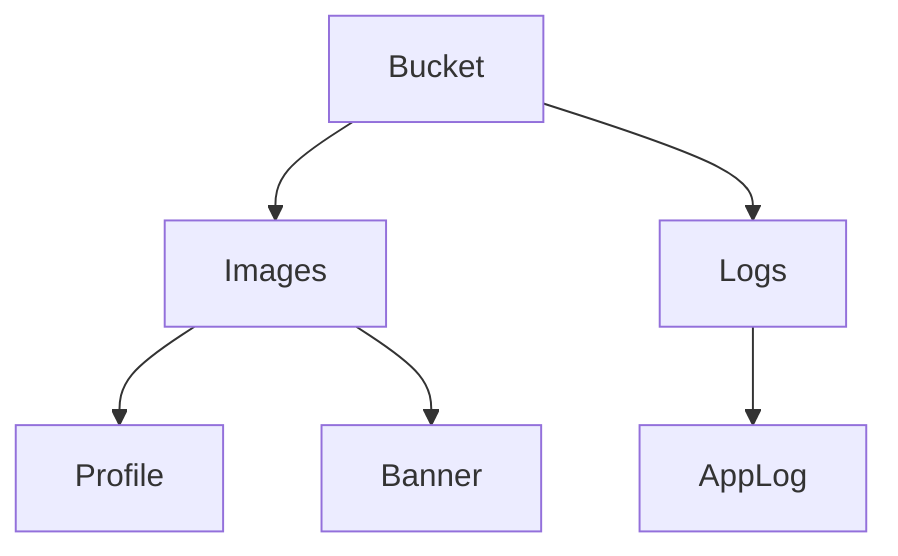

But technically, everything is an object key.

---

## 10. Object Naming Best Practices

Object names should be designed carefully.

Avoid sequential names:

```text
log1
log2
log3
```

Better:

```text
logs/2026/03/01/app.log
logs/2026/03/02/app.log
```

Or hashed prefixes for large systems:

```text
a1/logfile
b7/logfile
c9/logfile
```

This improves request distribution.

---

## 11. Bucket Versioning

Buckets can enable **object versioning**.

When enabled:

- Old versions of objects are preserved.

Without versioning:

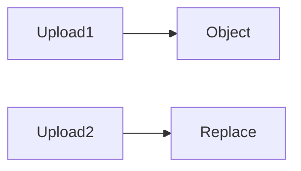

With versioning:

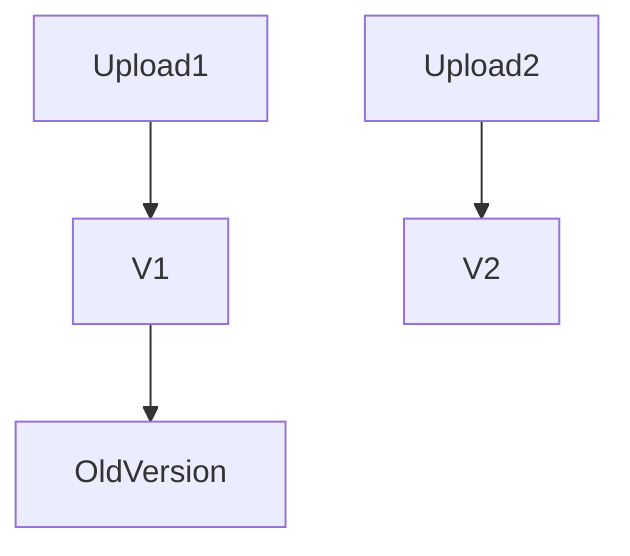

Benefits:

- Recover overwritten files
- Protect against accidental deletion

---

## 12. Object Retention and Holds

Buckets can enforce retention policies.

Example:

- Retain objects for 365 days.

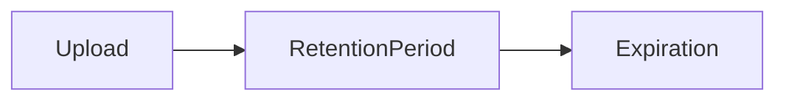

This is useful for:

- Compliance
- Regulatory requirements
- Legal archiving

Retention policies can also be **locked**.

---

## 13. Object Lifecycle Rules

Buckets can automatically manage objects.

Example lifecycle rule:

- Move to Coldline after 30 days
- Delete after 365 days

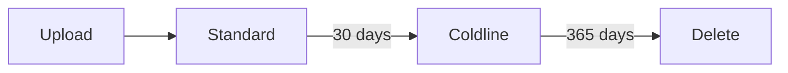

This reduces long-term storage costs.

---

## 14. Bucket Logging and Monitoring

Cloud Storage integrates with:

- Cloud Monitoring
- Cloud Logging
- Cloud Audit Logs

Example logging flow:

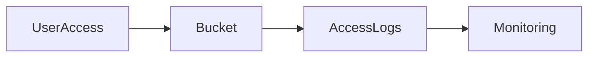

This helps detect:

- Unauthorized access
- Large downloads
- Suspicious activity

---

## 15. Managing Buckets

Buckets can be managed through:

- Google Cloud Console
- gcloud CLI
- gsutil CLI
- REST APIs
- Terraform

Example CLI command:

```bash
gsutil mb gs://my-new-bucket
```

List buckets:

```bash
gsutil ls
```

Delete bucket:

```bash
gsutil rb gs://my-new-bucket
```

---

## 16. Bucket Lifecycle Management

Buckets themselves can also have lifecycle rules.

Example:

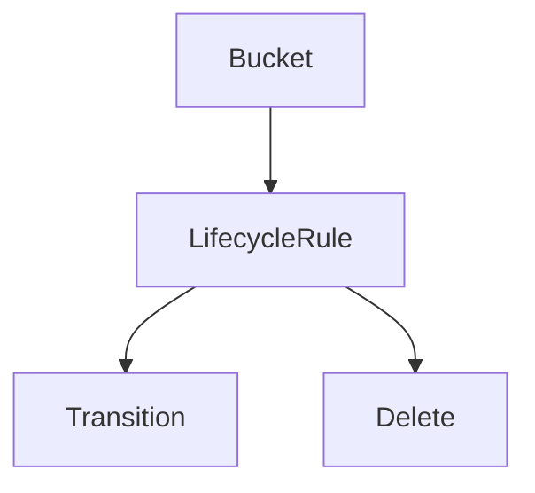

This automates storage optimization.

---

## 17. Best Practices for Bucket Design

1. Keep compute and storage in the same region.
2. Use uniform bucket-level access.
3. Enable public access prevention.
4. Use lifecycle rules for cost optimization.
5. Enable versioning for critical data.
6. Use labels for resource organization.
7. Design object naming carefully.

---

## 18. Summary

Buckets are the core storage container in Google Cloud Storage.

They determine:

- Where data is stored
- How it is accessed
- Security policies
- Lifecycle behavior

Understanding bucket configuration is essential for:

- Secure storage
- Efficient organization
- Cost optimization
- Scalable system design.

---
