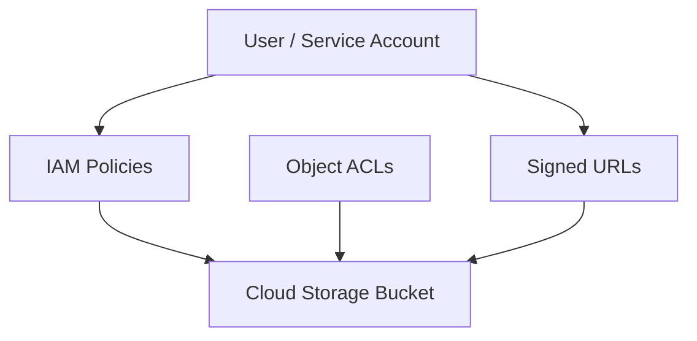
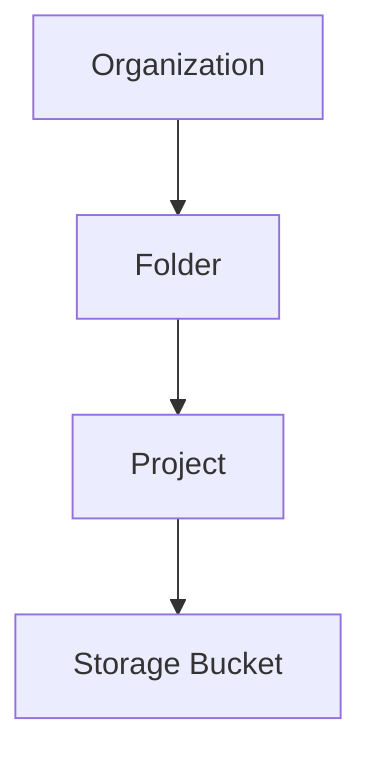
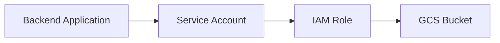
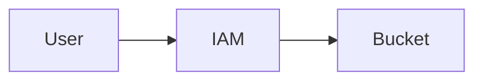
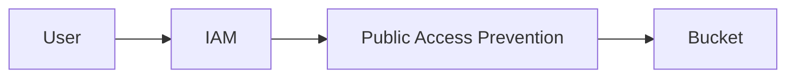
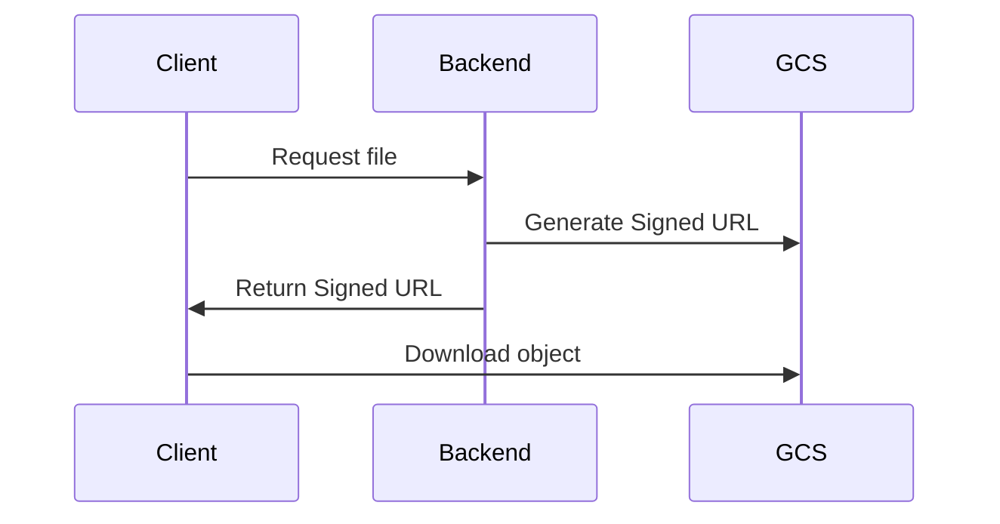
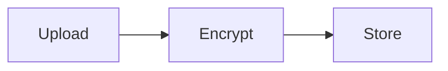
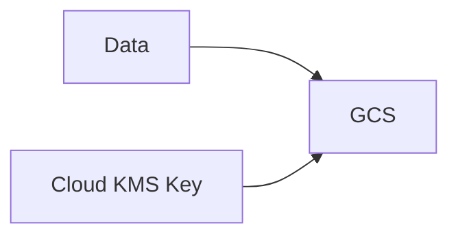
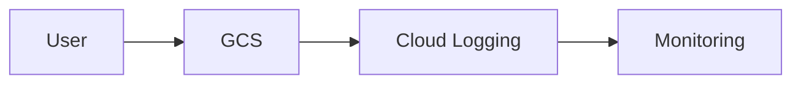
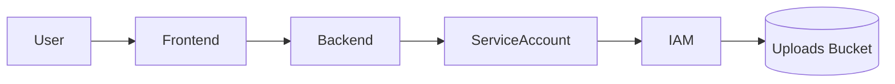

# Storage Security and IAM in GCS

This document explains **how security works in Google Cloud Storage (GCS)** and how to control access to your storage resources using **Identity and Access Management (IAM)** and other security mechanisms.

This guide is designed for **complete beginners**, and it explains each concept with examples and diagrams.

---

# 1. Why Storage Security Matters

Cloud storage often contains **sensitive or critical data**, such as:

- Application logs
- User uploaded files
- Database backups
- Machine learning datasets
- Internal documents

Without proper security:

- Data could be publicly exposed
- Unauthorized users could delete files
- Malicious users could upload harmful content

Google Cloud Storage provides **multiple security layers** to prevent these issues.

Main security layers include:

1. **IAM (Identity and Access Management)**
2. **Uniform Bucket-Level Access**
3. **Access Control Lists (ACLs)**
4. **Signed URLs**
5. **Encryption**
6. **Public Access Prevention**
7. **Audit Logs**

---

# 2. Security Layers in GCS

Cloud Storage security is implemented in **multiple layers**.



A user can access storage via:

- IAM permission
- Object ACL
- Signed URL

---

# 3. Identity and Access Management (IAM)

IAM controls **who can access what resources**.

IAM works using three components:

| Component | Description                    |
| --------- | ------------------------------ |
| Identity  | Who is requesting access       |
| Role      | What actions they can perform  |
| Resource  | Which resource they can access |

Example:

```
User: alice@example.com
Role: Storage Object Viewer
Resource: bucket-logs
```

Meaning:

Alice can **view objects inside bucket-logs**.

---

# 4. IAM Hierarchy in Google Cloud

Permissions inherit through the **resource hierarchy**.

```
Organization
   │
   └── Folder
          │
          └── Project
                 │
                 └── Storage Bucket
```

Permissions granted at a higher level propagate downward.



Example:

If a user has a role at the **project level**, they automatically get access to:

- All buckets inside the project.

---

# 5. Storage IAM Roles

Google provides **predefined IAM roles** for storage.

## 5.1 Storage Admin

Full control over Cloud Storage.

Role:

```
roles/storage.admin
```

Permissions:

- Create/delete buckets
- Upload/delete objects
- Manage permissions
- Configure lifecycle policies

Use case:

Platform administrators.

---

## 5.2 Storage Object Admin

Manage objects but not buckets.

```
roles/storage.objectAdmin
```

Permissions:

- Upload objects
- Delete objects
- Update objects

Example use case:

Application uploading files.

---

## 5.3 Storage Object Viewer

Read-only access.

```
roles/storage.objectViewer
```

Permissions:

- Download objects
- List objects

Example:

Users downloading files.

---

## 5.4 Storage Object Creator

Upload only.

```
roles/storage.objectCreator
```

Permissions:

- Upload new objects
- Cannot overwrite or delete

Example:

User uploads data but cannot modify existing data.

---

# 6. Granting IAM Access

IAM roles can be assigned using:

- Console
- gcloud CLI
- Terraform
- API

Example using gcloud:

```bash
gcloud projects add-iam-policy-binding PROJECT_ID \
    --member="user:alice@example.com" \
    --role="roles/storage.objectViewer"
```

Grant access to a service account:

```bash
gcloud projects add-iam-policy-binding PROJECT_ID \
    --member="serviceAccount:app-sa@project.iam.gserviceaccount.com" \
    --role="roles/storage.objectAdmin"
```

---

# 7. Service Accounts and Storage Access

Applications typically access GCS using **service accounts**.

Example architecture:



Example:

Your backend server may have:

```
Service Account: backend-sa
Role: Storage Object Admin
Bucket: app-uploads
```

Meaning:

The backend can upload and manage files.

---

# 8. Uniform Bucket-Level Access (Recommended)

Older GCS systems used **ACLs** to control access.

Modern systems should use **Uniform Bucket-Level Access**.

When enabled:

- IAM controls access
- Object ACLs are disabled



Advantages:

- Simpler permissions
- More secure
- Easier to manage

Enable using CLI:

```bash
gsutil uniformbucketlevelaccess set on gs://my-bucket
```

---

# 9. Access Control Lists (ACLs)

ACLs provide **object-level permissions**.

Example:

```
Object: photo.jpg

User: alice@example.com
Permission: READ
```

ACL structure:

| Entity   | Permission |
| -------- | ---------- |
| User     | READ       |
| Group    | WRITE      |
| AllUsers | READ       |

Example ACL:

```
Entity: allUsers
Permission: READ
```

This makes the object **public**.

Example:

```
https://storage.googleapis.com/bucket-name/image.jpg
```

⚠️ ACLs are considered **legacy** and usually replaced by IAM.

---

# 10. Public Access

A bucket or object becomes public if:

```
allUsers
```

or

```
allAuthenticatedUsers
```

are granted access.

Example ACL:

```
allUsers: READER
```

Meaning:

Anyone on the internet can download the file.

---

# 11. Public Access Prevention

To prevent accidental exposure, GCS provides:

**Public Access Prevention (PAP)**.

When enabled:

- Public IAM policies are blocked
- Public ACLs are rejected



Enable using CLI:

```bash
gsutil pap set enforced gs://my-bucket
```

---

# 12. Signed URLs

Signed URLs allow **temporary access to private objects**.

Example:

```
User downloads private file using a signed URL
```

Architecture:



Example use case:

- Private file downloads
- Temporary access
- Secure media delivery

Example URL:

```
https://storage.googleapis.com/bucket/file.pdf?X-Goog-Signature=abc123
```

The URL expires after a set time.

Example:

```
Expiration: 15 minutes
```

---

# 13. Encryption in Cloud Storage

Google Cloud automatically encrypts data.

Three encryption methods exist.

---

## 13.1 Google Managed Encryption (Default)

Google automatically encrypts data using:

```
AES-256
```

Process:



Users do not manage keys.

---

## 13.2 Customer Managed Encryption Keys (CMEK)

Users manage encryption keys using:

**Cloud KMS**

Architecture:



Benefits:

- Key rotation
- Access control
- Compliance

---

## 13.3 Customer Supplied Encryption Keys (CSEK)

Users provide encryption keys during upload.

Example:

```
Upload object with encryption key
```

Drawback:

If you lose the key:

```
Data cannot be recovered
```

---

# 14. Storage Audit Logs

Google Cloud provides **audit logs** for monitoring storage access.

Types of logs:

| Log Type       | Purpose                 |
| -------------- | ----------------------- |
| Admin Activity | Bucket changes          |
| Data Access    | Object read/write       |
| System Event   | Internal system changes |

Example event:

```
User: alice@example.com
Action: storage.objects.delete
Object: backup.zip
```

Architecture:



---

# 15. Best Practices for Storage Security

Follow these security practices.

### 1. Use Uniform Bucket-Level Access

Avoid ACLs.

---

### 2. Use Least Privilege

Grant only required permissions.

Example:

Use:

```
Storage Object Viewer
```

Instead of:

```
Storage Admin
```

---

### 3. Enable Public Access Prevention

Avoid accidental public data exposure.

---

### 4. Use Service Accounts

Applications should use **service accounts**, not user credentials.

---

### 5. Use Signed URLs

For temporary file sharing.

---

### 6. Enable Audit Logs

Monitor suspicious activity.

---

# 16. Real World Example Architecture

Example:

File upload system.



Flow:

1. User uploads file
2. Backend receives file
3. Backend uploads to GCS using service account
4. IAM controls permissions

---

# 17. Summary

Cloud Storage security relies on multiple systems:

| Security Layer              | Purpose                     |
| --------------------------- | --------------------------- |
| IAM                         | Access control              |
| Uniform Bucket-Level Access | Simplified permissions      |
| ACLs                        | Legacy object-level control |
| Signed URLs                 | Temporary access            |
| Encryption                  | Protect stored data         |
| Public Access Prevention    | Prevent accidental exposure |
| Audit Logs                  | Track access                |

When designing secure storage systems:

- Prefer **IAM over ACL**
- Use **least privilege**
- Enable **public access prevention**
- Use **service accounts**
- Monitor access using **audit logs**

---
